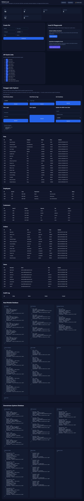
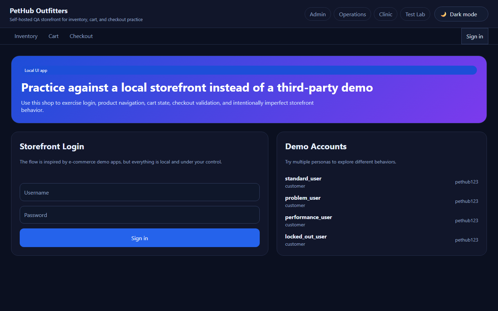
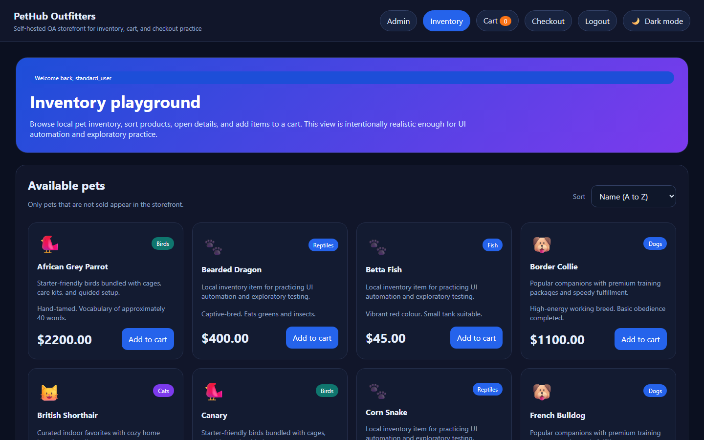
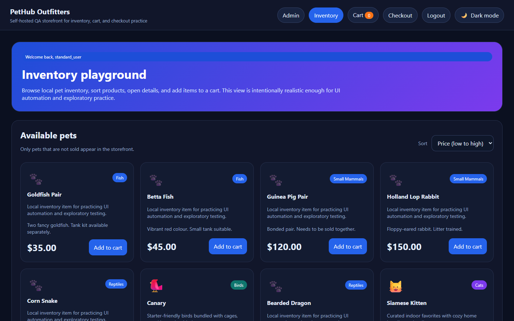
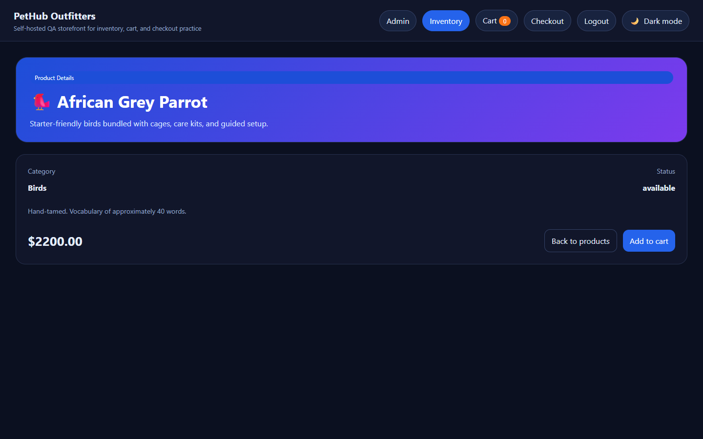
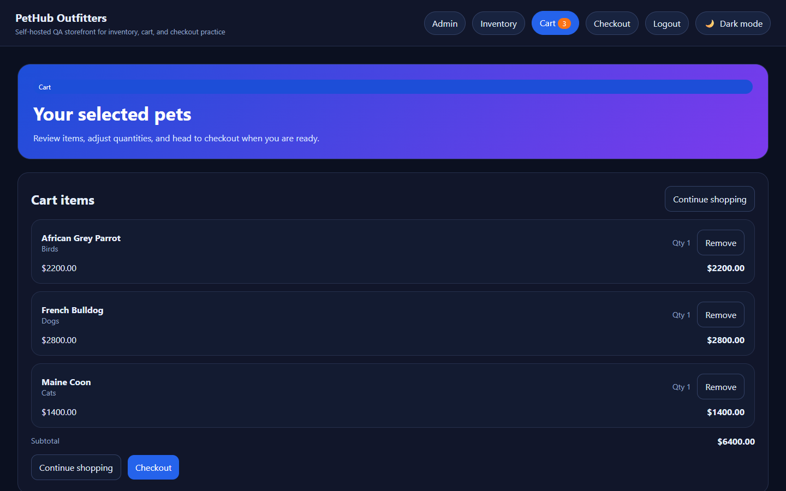
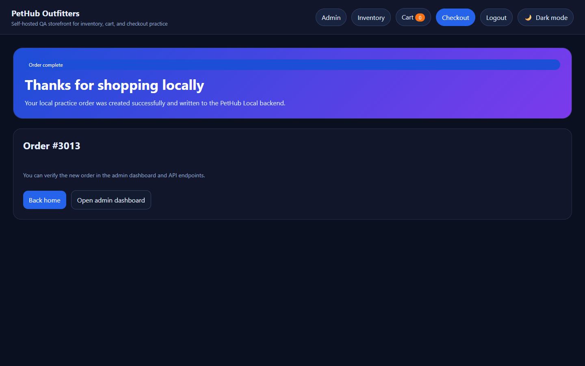
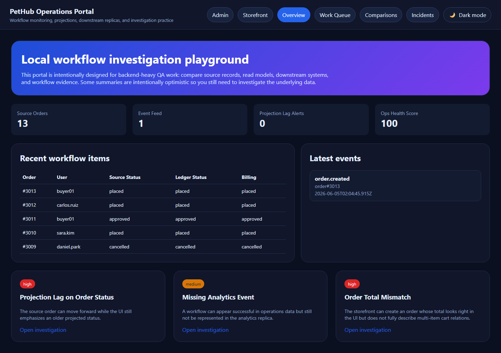
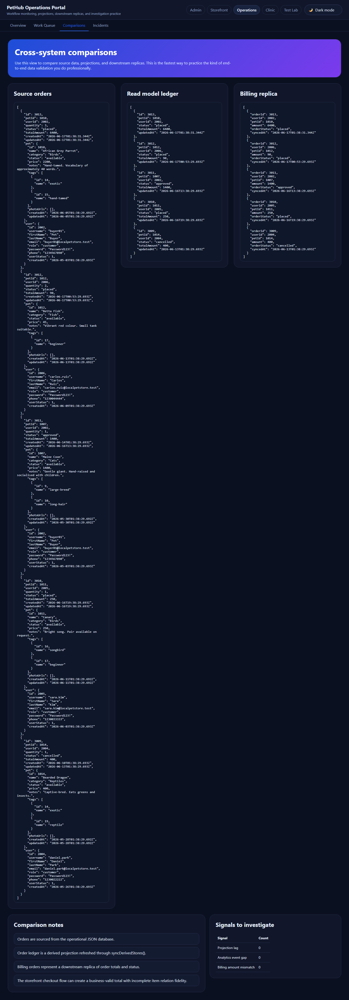

# Playwright QA Portfolio

End-to-end and API test automation portfolio in TypeScript and Playwright. Demonstrates page-object architecture, builder-based test data, multi-target test design, event-driven CQRS-style read models, and CI hardening.

The portfolio exercises three target systems:

- **Swagger Petstore** — public REST API and UI demo (`https://petstore.swagger.io/`)
- **Sauce Demo** — public e-commerce UI demo (`https://www.saucedemo.com/`)
- **PetHub Local** — a self-contained Express + lowdb application included in this repo for deterministic local QA practice (see `apps/pethub-local`). Its surfaces — Admin, Storefront, **PetHub Clinic**, Operations and a **QA Test Lab** — are all mutually reachable via a shared cross-app navigation switcher.

## Visual tour

A guided walkthrough of the PetHub Local app. All images below are produced deterministically by `npm.cmd run screenshots`, which resets the database and walks Playwright through the canonical flows.

### Admin dashboard



The admin dashboard at `/` aggregates every backend concept the test suite exercises in one place:

- **Pets, Users, Customers, Employees, Orders** — operational tables
- **Audit log + relations** — every mutation has a row tying user, pet, and order together
- **Read models** — separate JSON store; eventually-consistent projections fed by domain events (CQRS-style)
- **Downstream systems** — third JSON store; simulates billing / analytics replicas
- **Swagger-style explorer** — interactive API surface for ad hoc testing

Three independent JSON databases live under `apps/pethub-local/data/`: operational, read models, and downstream replicas. Tests compare them with SQL-style joins via `JsonSqlDatabase`.

### Storefront — login



The `/shop` storefront is intentionally Sauce-Demo-shaped so the same Playwright patterns (page objects, fixtures, `data-test` selectors) used against the public Sauce Demo target also apply here. Demo accounts are listed inline so the page itself doubles as a credential reference.

### Storefront — inventory



15 pets are visible (12 available + 3 pending; 3 sold pets are filtered out by design). Tags, categories, and varied prices feed sort and filter assertions across multiple browsers.

### Storefront — price-sorted inventory



Server-side sort via `?sort=lohi`. The price ladder runs from $35 (Goldfish Pair) to $2,800 (French Bulldog), giving sort tests something meaningful to assert on.

### Storefront — item details



Drill-down view at `/shop/item/:id`. Used by tests that assert deep-link navigation, back-button preservation, and add-to-cart from a non-list context.

### Storefront — cart



Session-scoped cart (in-memory, not persisted to lowdb) with three pets selected. The cart badge reflects line count, the subtotal sums line totals, and Remove rebuilds the session state.

### Storefront — order confirmation



End of the checkout flow. POSTing the checkout form creates an order in the operational database, emits an `order.created` event, projects to the read model, and replicates to the downstream JSON store — all of which the API specs verify in `tests/targets/pethub-local/api/`.

### Operations portal — overview



A dedicated `/ops` portal designed for QA investigation rather than end-customer interaction. Hero copy is intentionally optimistic so testers must dig into the underlying data to confirm reality.

### Operations portal — cross-system comparisons



The most distinctive view of the app: side-by-side dump of source orders, read-model projections, and downstream replicas. This is where mismatches between the three databases become visible. Used to practice the kind of multi-database investigation common in real backend QA work.

### Regenerating screenshots

Screenshots are produced by Playwright against the running app:

```powershell
# Terminal A — start the app
npm.cmd run app:start

# Terminal B — capture all 9 images
npm.cmd run screenshots
```

The script (`scripts/capture-screenshots.ts`) calls `POST /api/admin/reset` first so each run produces images against the canonical seed data, then walks the storefront flow end-to-end (login → inventory → details → cart → checkout → confirmation) before capturing the ops portal views.

## Returning to this project after a while?

If you have not touched this repo in months, run through this checklist before anything else. For a longer absence (a year or more), the `/repo-revival` workflow scripts the same flow with extra checks for accumulated rot.

1. **Check Node version**: `node --version` must satisfy `engines` in `package.json` (currently `>=24.0.0`). The pinned LTS major lives in `.nvmrc`. If Node 24 is past EOL, bump `.nvmrc` to the current LTS.
2. **Reinstall dependencies cleanly**: `npm.cmd ci` (uses `package-lock.json` exactly).
3. **Run the environment doctor**: `npm.cmd run doctor` (prints versions and runs a TypeScript type check).
4. **Smoke test the local app**: `npm.cmd run test:pethub-local` — fully self-contained, no external sites needed.
5. **If `npx playwright install` fails with download errors**, the browser binaries for the pinned Playwright version may have rotated out of Microsoft's CDN. Bump Playwright with `npm.cmd install -D @playwright/test@latest`, then `npx playwright install`. Page objects, fixtures, and configs are version-tolerant so this is usually a one-line fix.
6. **If external suites fail**, the public Swagger Petstore or Sauce Demo sites may have changed. Check the most recent scheduled CI run on GitHub for context. External target jobs are configured as **informational** in CI so they do not block PRs.

## Stack

- Playwright Test
- TypeScript
- Page Object Model
- Typed DTOs
- Builder-based test data

## Project structure

- `src/pages`
  - UI page objects
- `src/helpers`
  - API clients and test data helpers
- `src/core`
  - shared base page/client abstractions
- `src/fixtures`
  - system-specific Playwright fixture entry points
- `src/models/api`
  - DTO contracts
- `src/builders`
  - DTO builders
- `tests/targets/swagger-petstore/api`
  - Swagger Petstore API specs
- `tests/targets/swagger-petstore/ui`
  - Swagger Petstore UI specs
- `tests/targets/sauce-demo/ui`
  - Sauce Demo UI specs
- `tests/targets/pethub-local/api`
  - PetHub Local API specs
- `tests/targets/pethub-local/ui`
  - PetHub Local admin, storefront (`/shop`), ops portal (`/ops`), and QA Test Lab (`/lab`) UI specs
- `apps/pethub-local`
  - PetHub Local Express + embedded-database app
- `.windsurf/workflows`
  - AI-assisted planning/generation/healing workflows

## PetHub Local app

The PetHub Local app provides:

- a web admin page at `/`
- local persistent pet, user, order, and audit-log data
- API endpoints under `/api`
- a v2 “platform” API tier for auth, validation, pagination, rate limiting, async jobs, idempotency, security and observability testing
- a **QA Test Lab**: a `/lab` UI automation playground (forms, dynamic content, dialogs, tables, widgets, frames, shadow DOM) plus stateless httpbin-style HTTP utilities under `/api/lab`
- seeded demo data for stable automation

### PetHub Local endpoints

- `GET /api/health`
- `GET /api/pets`
- `GET /api/pets/:id`
- `GET /api/pets/:id/relations`
- `POST /api/pets`
- `PUT /api/pets/:id`
- `DELETE /api/pets/:id`
- `GET /api/users`
- `GET /api/users/:id`
- `GET /api/users/:id/relations`
- `POST /api/users`
- `GET /api/orders`
- `GET /api/orders/:id`
- `GET /api/orders/:id/relations`
- `POST /api/orders`
- `PATCH /api/orders/:id/status`
- `GET /api/audit-log`
- `GET /api/audit-log/relations`
- `POST /api/admin/reset` — truncates and reseeds the local database (used by Playwright `globalSetup`)

### PetHub Local platform surfaces (v2)

A second, additive tier of endpoints gives QA more **types** of testing to
practice against a deterministic backend (see
[docs/pethub-local/app.md](docs/pethub-local/app.md#7-rest-api) for the full table
and the [HTML roadmap](docs/pethub-local/qa-feature-plan.html)):

- `GET /api/version`, `GET /api/ready`, `GET /api/metrics`, `GET /api/openapi.json` — observability & contract
- `POST /api/auth/login`, `GET /api/auth/me` — bearer-token auth & RBAC (`401`/`403`)
- `GET /api/v2/pets` — pagination / filtering / sorting / search envelope
- `POST /api/v2/pets` — strict validation (`422` with field-level errors)
- `DELETE /api/v2/pets/:id` — admin-only delete (RBAC)
- `POST /api/v2/orders` — idempotent creation via `Idempotency-Key`
- `GET /api/v2/rate-limited` — `429` + `Retry-After` rate limiting
- `GET /api/v2/echo` — reflected-input HTML escaping (XSS sandbox)
- `POST /api/jobs`, `GET /api/jobs/:id` — asynchronous job polling

### PetHub Local QA Test Lab (`/lab` + `/api/lab`)

A UI automation playground and a set of stateless HTTP utilities for practising
core browser- and protocol-level techniques against a deterministic surface (see
[docs/pethub-local/app.md §6.4](docs/pethub-local/app.md#64-qa-test-lab-lab) and
[§7 `/api/lab`](docs/pethub-local/app.md#qa-test-lab--http-utilities-apilab)):

- `/lab/forms` — every input type with client-side validation
- `/lab/dynamic` — deferred loading, add/remove elements, enable/disable
- `/lab/dialogs` — native `alert` / `confirm` / `prompt`
- `/lab/tables` — searchable, column-sortable data table
- `/lab/widgets` — tabs, accordion, modal, tooltip, progress bar, toast, clipboard, key press
- `/lab/menus` — native/multiple/dependent selects, custom listbox, action, context, flyout, hamburger & split menus
- `/lab/frames` — an iframe with scoped interactions; `/lab/shadow-dom` — an open shadow root
- `GET|ALL /api/lab/anything` — request reflection; `/status/:code`, `/delay/:seconds`, `/redirect/:n`
- `/api/lab/basic-auth/*`, `/bearer`, `/cookies*`, `/base64/*`, `/cache`, `/gzip`, `/json|/xml|/html`

### PetHub Clinic (`/clinic` + `/api/clinic`)

A veterinary appointment-booking business layered on top of the platform — a
worked example of adding a whole new vertical. It keeps its own **deterministic,
in-memory store** (reset on every server start, separate from the lowdb petstore)
so the existing suites stay green (see
[docs/pethub-local/app.md §6.5](docs/pethub-local/app.md#65-pethub-clinic-clinic)
and [§7 `/api/clinic`](docs/pethub-local/app.md#pethub-clinic-api-apiclinic)):

- `/clinic` — services, pricing and vets; `/clinic/appointments` — booked appointments
- `/clinic/book` — a four-step booking wizard (progressive enhancement; works without JS)
- `/clinic/confirmation/:ref` — confirmation with a unique `CLN-####` reference
- `GET /api/clinic/services|vets|slots` — reference data (one slot is unavailable)
- `POST /api/clinic/appointments` — booking with `422` field-level validation
- `GET /api/clinic/appointments[/:ref]` — read all / one (`200` / `404`)

Every primary surface (Admin, Storefront, Clinic, Operations, Test Lab) links to
every other via a shared cross-app navigation switcher.

### Install dependencies

```powershell
npm.cmd install
```

### Run PetHub Local app

```powershell
npm.cmd run app:start
```

### Stop local app

If you started it in the terminal, press:

```powershell
Ctrl + C
```

If it is running in a background terminal in the IDE, stop that terminal/process from the IDE terminal panel.

The app runs by default at:

- UI: `http://127.0.0.1:3000`
- API: `http://127.0.0.1:3000/api`

The PetHub Local app now also exposes relationship views so you can verify connected data between pets, users, orders, and audit entries.

### Target environment variables

Default target URLs are centralized in:

- `test-targets.config.ts`

Create a `.env` file from `.env.example` or use these values:

```dotenv
PUBLIC_BASE_URL=https://petstore.swagger.io
PUBLIC_API_BASE_URL=https://petstore.swagger.io/v2
LOCAL_BASE_URL=http://127.0.0.1:3000
LOCAL_API_BASE_URL=http://127.0.0.1:3000/api
```

## Test targets

The framework keeps **multiple systems under test**:

- Swagger Petstore
- Sauce Demo
- PetHub Local

The repo is organized by **system first** and then by **test type**, which is easier to scale in larger teams and multi-application automation portfolios.

They already use separate classes:

- Swagger Petstore UI page object: `src/pages/swagger-petstore/home.page.ts`
- Swagger Petstore API client: `src/helpers/api-clients/swagger-petstore-api.client.ts`
- Swagger Petstore fixtures: `src/fixtures/swagger-petstore/index.ts`
- Sauce Demo page objects: `src/pages/sauce-demo/*.page.ts`
- Sauce Demo fixtures: `src/fixtures/sauce-demo/index.ts`
- PetHub Local UI page object: `src/pages/pethub-local/home.page.ts`
- PetHub Local API client: `src/helpers/api-clients/pethub-local-api.client.ts`
- PetHub Local fixtures: `src/fixtures/pethub-local/index.ts`

Swagger Petstore specs live under `tests/targets/swagger-petstore`.

Sauce Demo specs live under `tests/targets/sauce-demo`.

PetHub Local specs live under `tests/targets/pethub-local`.

## Run tests

```powershell
npm.cmd test
```

`npm test` runs the external suite first (Swagger Petstore + Sauce Demo, fully parallel) and then the PetHub Local suite (sequential, `workers: 1`). The two suites use dedicated Playwright configs:

- `playwright.config.ts` - external targets, full parallelism, no local web server
- `playwright.local.config.ts` - PetHub Local UI + API, single worker, owns the `webServer` and `globalSetup` that resets the lowdb-backed database

The split exists because the locally-hosted PetHub app stores state in a single shared JSON file (lowdb). Multiple test files writing concurrently can corrupt that state, so all PetHub Local specs are serialized through one Express process and one shared database file.

For PetHub Local projects, Playwright uses `webServer` to automatically start the app and reuse an already running instance when possible.

That means `test:pethub-local`, `test:pethub-local:ui`, and `test:pethub-local:api` no longer require you to manually start the app first.

Run only the Swagger Petstore suite:

```powershell
npm.cmd run test:swagger-petstore
```

Run only the Sauce Demo suite:

```powershell
npm.cmd run test:sauce-demo
```

Run only the PetHub Local suite:

```powershell
npm.cmd run test:pethub-local
```

Run only the Swagger Petstore API suite:

```powershell
npm.cmd run test:swagger-petstore:api
```

Run only the Sauce Demo UI suite:

```powershell
npm.cmd run test:sauce-demo:ui
```

Run only the PetHub Local API suite:

```powershell
npm.cmd run test:pethub-local:api
```

Run only the Swagger Petstore UI suite:

```powershell
npm.cmd run test:swagger-petstore:ui
```

Run only the PetHub Local UI suite:

```powershell
npm.cmd run test:pethub-local:ui
```

Run only the external (parallel) targets:

```powershell
npm.cmd run test:external
```

Run only the local (serial) target:

```powershell
npm.cmd run test:local
```

UI across all targets:

```powershell
npm.cmd run test:ui
```

API across all targets:

```powershell
npm.cmd run test:api
```

### Accessibility (`@a11y`)

A dedicated `pethub-local-a11y` Playwright project runs WCAG 2.0 / 2.1 A and AA checks against the local app using `@axe-core/playwright`. Specs live under `tests/targets/pethub-local/a11y/` and cover:

- **Admin** — `/` dashboard
- **Storefront** — `/shop` login, `/shop/inventory`, `/shop/item/:id`, `/shop/cart`, `/shop/checkout`
- **Ops portal** — `/ops`, `/ops/queue`, `/ops/comparisons`, `/ops/incidents`

The shared helper `src/helpers/a11y.ts` filters Axe violations to `critical` or `serious` impact and fails the test if any are found. Lower-impact issues are still surfaced in the report but not enforced.

Run only the a11y suite:

```powershell
npm.cmd run test:a11y
```

Tests are tagged `@a11y` so they can also be excluded from the default suite via `--grep-invert @a11y` if needed.

### Authentication state reuse (Sauce Demo)

The Sauce Demo target uses Playwright's `storageState` pattern so tests skip the redundant login flow. One login runs in a dedicated setup project, the resulting browser state (cookies + localStorage) is saved to disk, and every UI project then loads that file before each test.

**Where this is implemented in the repo:**

| Concern                                          | File                                                                                               |
| ------------------------------------------------ | -------------------------------------------------------------------------------------------------- |
| Setup project that logs in and saves state       | `tests/targets/sauce-demo/sauce-demo.setup.ts`                                                     |
| Project wiring (`dependencies` + `storageState`) | `playwright.config.ts`                                                                             |
| Opt-out for tests that need a logged-out browser | `tests/targets/sauce-demo/ui/login.spec.ts`, `session-protection.spec.ts`, `known-defects.spec.ts` |

#### How to add `storageState` to another target — 3 steps

**Step 1 — Create a setup spec that logs in and saves browser state.** Place it next to the target's tests, not inside the `ui/` folder. Use the same page objects as the rest of the suite so the login flow stays DRY.

```typescript
// tests/targets/<target>/<target>.setup.ts
import { test as setup } from '@playwright/test';
import { MyLoginPage } from '@pages/<target>/login.page';

const STORAGE_STATE_FILE = 'playwright/.auth/<target>-standard.json';

setup('authenticate as standard_user', async ({ page }) => {
  const loginPage = new MyLoginPage(page);
  await loginPage.goto();
  await loginPage.login('standard_user', 'secret_sauce');
  // assert post-login state, e.g. inventory page is loaded

  await page.context().storageState({ path: STORAGE_STATE_FILE });
});
```

**Step 2 — Register a setup project and wire each UI project to depend on it.** The setup project runs first; UI projects inherit the saved state.

```typescript
// playwright.config.ts
projects: [
  {
    name: '<target>-setup',
    testMatch: /tests\/targets\/<target>\/<target>\.setup\.ts/,
    use: { baseURL: targetUiBaseUrl },
  },
  {
    name: '<target>-ui-chromium',
    testMatch: /tests\/targets\/<target>\/ui\/.*\.spec\.ts/,
    dependencies: ['<target>-setup'],
    use: {
      ...devices['Desktop Chrome'],
      baseURL: targetUiBaseUrl,
      storageState: 'playwright/.auth/<target>-standard.json',
    },
  },
  // repeat for firefox, webkit, etc.
];
```

**Step 3 — Opt out per `describe` for tests that need a logged-out browser.** Tests that verify the login flow itself, session protection, or alternative users must override the project-level `storageState` at the top of the describe so they start with a clean session.

```typescript
test.describe('Login', () => {
  test.use({ storageState: { cookies: [], origins: [] } });

  // every test in this block starts logged out
  test('shows an error for invalid credentials', async ({ page }) => {
    /* ... */
  });
});
```

**Don't forget:** add the auth directory to `.gitignore` so the generated state file is never committed. The setup project regenerates it on every run.

```gitignore
playwright/.auth/
```

### Test tiers (`@smoke`, `@critical`)

Tests are tagged inline with Playwright's `tag` annotation so subsets can be run for tiered CI feedback.

| Tier                  | Run when                      | Target time       | What is included                                                                   |
| --------------------- | ----------------------------- | ----------------- | ---------------------------------------------------------------------------------- |
| `@smoke`              | Every PR / commit             | <1 min            | The minimum viable end-to-end signal across all three targets - is each one alive? |
| `@critical`           | Before deploy / merge to main | <2 min            | Subset of smoke covering business-critical happy paths only                        |
| Untagged (full suite) | Nightly / on demand           | Whatever it takes | Everything else - all positive paths, negative paths, and pinned-defect specs      |

Run subsets:

```powershell
npm.cmd run test:smoke      # ~15 tests across all targets
npm.cmd run test:critical   # ~6 tests; must-pass before deploy
```

Tagged test count today: **8 distinct tests** are `@smoke` (some run on multiple browsers, expanding the count). **5 of those 8** are also `@critical`. The full suite remains the default `npm.cmd test`.

Tags are applied inline:

```typescript
test('returns service health', { tag: ['@smoke', '@critical'] }, async ({ localApiClient }) => {
  // ...
});
```

To extend the smoke tier, add `{ tag: '@smoke' }` to the new test - no other config changes are needed.

### Reports

The two configs write to separate HTML reports so they don't overwrite each other:

```powershell
npm.cmd run report         # external suite
npm.cmd run report:local   # PetHub Local suite
```

## Lint and format

```powershell
npm.cmd run lint
npm.cmd run lint:fix
npm.cmd run format
npm.cmd run format:check
```

- ESLint config: `eslint.config.mjs` (flat config; TypeScript + Playwright rules)
- Prettier config: `.prettierrc.json`

## AI-assisted workflow

This repository keeps **explicit Playwright code** as the source of truth. AI is intended to assist with planning, generation, analysis, and coverage review.

### Available workflows

- `.windsurf/workflows/ai-test-planner.md`
  - turn requirements into a concrete test plan
- `.windsurf/workflows/ai-test-generator.md`
  - generate code that matches repo conventions
- `.windsurf/workflows/ai-test-healer.md`
  - analyze failures and propose minimal fixes
- `.windsurf/workflows/ai-coverage-assistant.md`
  - review existing test coverage and identify gaps

### Recommended usage pattern

1. Use the planner to define scenarios.
2. Use the generator to produce draft code.
3. Review generated changes.
4. Run Playwright.
5. Use the healer only when failures need investigation.
6. Periodically use the coverage assistant to spot gaps.

### Important principle

Do **not** treat AI-generated steps as the runtime test layer. Keep committed tests as readable Playwright code with page objects, API clients, DTOs, and builders.

## License

© 2026 stalevski. All rights reserved.

This repository is public for demonstration and educational review only. No permission is granted to use, copy, modify, merge, publish, distribute, or sublicense the code without explicit written permission. For inquiries, please open an issue or contact the repository owner.
