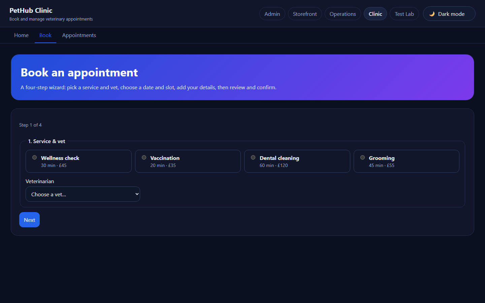
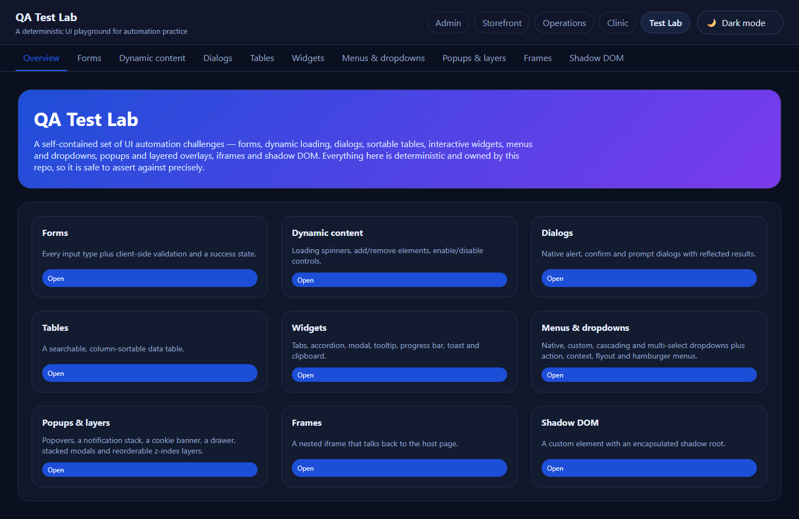
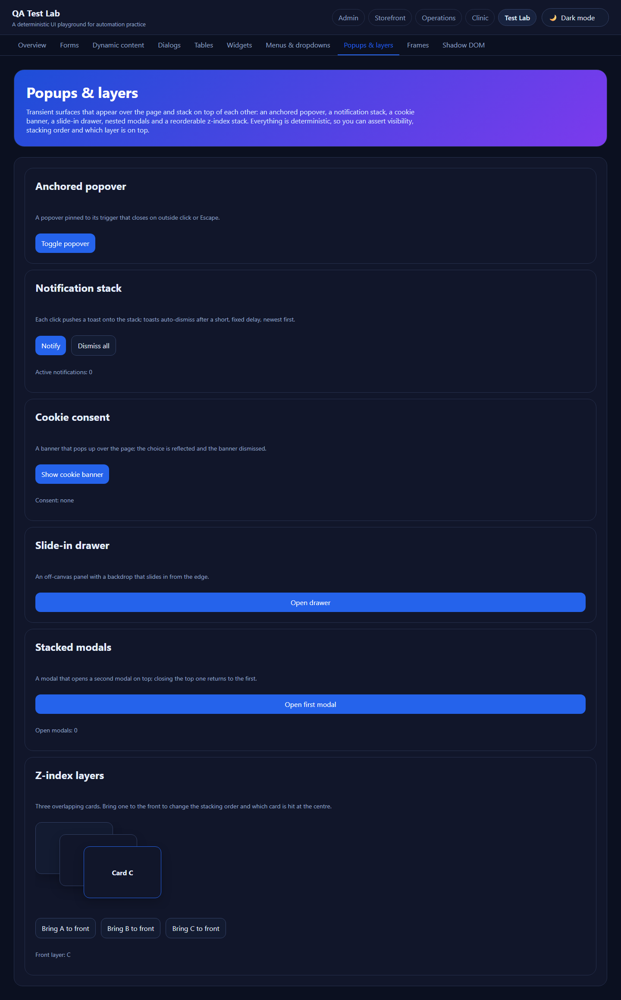

# Playwright QA Portfolio

[](https://github.com/stalevski/playwright-qa-portfolio/actions/workflows/playwright.yml)
[](https://playwright.dev/)
[](https://www.typescriptlang.org/)
[](.nvmrc)

A TypeScript + Playwright test-automation portfolio. It pairs real-world testing techniques - page objects, typed API clients, builder-based data, accessibility checks and tiered CI - with **PetHub Local**, a small Express + lowdb app built into the repo so every example runs deterministically on your machine, no flaky public sites required.

> **Built AI-assisted, human-directed.** Planned, generated, and tested with AI tooling under my
> direction - see [AI-assisted workflow](#ai-assisted-workflow). The architecture, review, and final decisions are mine.

It exercises three target systems:

- **PetHub Local** - a self-contained Express + lowdb app in this repo (`apps/pethub-local`). The **primary** target: deterministic, fully owned, and needs no internet. Its surfaces - Admin, Storefront, **Clinic**, Operations and a **QA Test Lab** - share a cross-app navigation switcher.
- **Swagger Petstore** - public REST API + UI demo (`https://petstore.swagger.io/`). Informational; some specs deliberately assert known bugs.
- **Sauce Demo** - public e-commerce UI demo (`https://www.saucedemo.com/`). Informational; demonstrates `storageState` auth reuse.

## Contents

- [Quickstart](#quickstart)
- [What's inside](#whats-inside)
- [Visual tour](#visual-tour)
- [Architecture](#architecture)
- [PetHub Local app](#pethub-local-app)
- [Running tests](#running-tests)
- [Accessibility](#accessibility-a11y)
- [Authentication state reuse](#authentication-state-reuse-sauce-demo)
- [Test tiers](#test-tiers-smoke-critical)
- [AI-assisted workflow](#ai-assisted-workflow)
- [Maintenance](#maintenance)
- [License](#license)

## Quickstart

Requires **Node 24** (see [`.nvmrc`](.nvmrc)). The commands below work as written in PowerShell on Windows, and in bash/zsh on macOS and Linux.

```bash
# 1. Install dependencies
npm install

# 2. Install Playwright browsers
npx playwright install

# 3. Run the deterministic local suite
#    Playwright starts PetHub Local for you and resets its database first.
npm run test:local
```

Want to click around the app yourself?

```bash
npm run app:start   # serves the UI + API at http://127.0.0.1:3000
npm run stop        # frees port 3000 when you are done
```

> Returning after a long break? See [Maintenance](#maintenance) for a revival checklist.

## What's inside

- **End-to-end UI tests** built on the Page Object Model, scoped components, and app-owned `data-test` locators.
- **Typed API tests** with clients that extend a shared `BaseApiClient`, DTOs for transport, and fluent builders for data.
- **A real app to test against** - PetHub Local models an operational database, event-driven **CQRS-style read models**, and **downstream replicas**, so specs can practise the cross-system data investigation common in backend QA.
- **Accessibility checks** (`@axe-core/playwright`) across every PetHub surface.
- **Tiered CI** via `@smoke` / `@critical` tags, `storageState` auth reuse, and a `/lab` playground of deterministic UI-automation challenges.

Engineering conventions live in [AGENTS.md](AGENTS.md) and [TEST_AUTOMATION_STANDARDS.md](TEST_AUTOMATION_STANDARDS.md).

## Visual tour

A guided walkthrough of PetHub Local. Every image below is produced deterministically by `npm run screenshots`, which resets the database and walks Playwright through the canonical flows.

### Admin dashboard


The admin dashboard at `/` aggregates every backend concept the test suite exercises in one place:

- **Pets, Users, Customers, Employees, Orders** - operational tables
- **Audit log + relations** - every mutation has a row tying user, pet, and order together
- **Read models** - separate JSON store; eventually-consistent projections fed by domain events (CQRS-style)
- **Downstream systems** - third JSON store; simulates billing / analytics replicas
- **Swagger-style explorer** - interactive API surface for ad hoc testing

Three independent JSON databases live under `apps/pethub-local/data/`: operational, read models, and downstream replicas. Tests compare them with SQL-style joins via `JsonSqlDatabase`.

### Storefront - login


The `/shop` storefront is intentionally Sauce-Demo-shaped so the same Playwright patterns (page objects, fixtures, `data-test` selectors) used against the public Sauce Demo target also apply here. Demo accounts are listed inline so the page itself doubles as a credential reference. Like Sauce Demo, some accounts carry **intentional defects** discovered only by testing: `problem_user` gets a dead sort control, a silently-failing add-to-cart for Birds, and a checkout that always rejects the last name, while `performance_user` browses under injected latency - `standard_user` stays on the happy path.

### Storefront - inventory


15 pets are visible (12 available + 3 pending; 3 sold pets are filtered out by design). Tags, categories, and varied prices feed sort and filter assertions across multiple browsers.

### Storefront - price-sorted inventory


Server-side sort via `?sort=lohi`. The price ladder runs from $35 (Goldfish Pair) to $2,800 (French Bulldog), giving sort tests something meaningful to assert on.

### Storefront - item details


Drill-down view at `/shop/item/:id`. Used by tests that assert deep-link navigation, back-button preservation, and add-to-cart from a non-list context.

### Storefront - cart


Session-scoped cart (in-memory, not persisted to lowdb) with three pets selected. The cart badge reflects line count, the subtotal sums line totals, and Remove rebuilds the session state.

### Storefront - order confirmation


End of the checkout flow. POSTing the checkout form creates an order in the operational database, emits an `order.created` event, projects to the read model, and replicates to the downstream JSON store - all of which the API specs verify in `tests/local/pethub-local/api/`.

### Operations portal - overview


A dedicated `/ops` portal designed for QA investigation rather than end-customer interaction. Hero copy is intentionally optimistic so testers must dig into the underlying data to confirm reality.

### Operations portal - cross-system comparisons


The most distinctive view of the app: side-by-side dump of source orders, read-model projections, and downstream replicas. This is where mismatches between the three databases become visible. Used to practice the kind of multi-database investigation common in real backend QA work.

### PetHub Clinic - appointment booking



The `/clinic` surface is a four-step booking wizard (service & vet → date & slot → owner details → review & confirm). Each step gates the next, so it is ideal for practising multi-step form validation, conditional enablement, and confirmation-reference assertions.

### QA Test Lab - challenge overview



The `/lab` surface is a self-contained set of deterministic UI automation challenges - forms, dynamic content, dialogs, sortable tables, widgets, menus & dropdowns, popups & layers, frames and shadow DOM. Everything is owned by this repo, so the patterns are safe to assert against precisely.

### QA Test Lab - popups & layers



The `/lab/overlays` page focuses on transient surfaces and z-index stacking: an anchored popover, an auto-dismissing notification stack, a cookie-consent banner, a slide-in drawer, nested modals and a reorderable z-index stack. It mirrors real layering bugs (overlapping menus, modal-on-modal, hit-testing the topmost layer).

### Regenerating screenshots

Screenshots are produced by Playwright against the running app:

```bash
# Terminal A - start the app
npm run app:start

# Terminal B - capture all 12 images
npm run screenshots
```

The script (`scripts/capture-screenshots.ts`) calls `POST /api/admin/reset` first so each run produces images against the canonical seed data, then walks the storefront flow end-to-end (login → inventory → details → cart → checkout → confirmation) before capturing the ops portal, clinic and QA Test Lab views.

## Architecture

Organized **system-first, then test-type**, which scales cleanly across multiple applications and teams.

```text
apps/pethub-local/      Express + lowdb app (admin, storefront, clinic, ops, QA Test Lab)
src/
  core/                 BasePage, BaseApiClient, global setup
  pages/<system>/       page objects (one per screen); components/ for shared UI
  helpers/api-clients/  typed API clients (extend BaseApiClient)
  fixtures/<system>/    Playwright fixtures (re-export test/expect)
  builders/             fluent DTO builders (pet, order, user)
  models/api/           DTOs / typed transport
tests/local/pethub-local/{ui,api,a11y}/  specs for our own in-repo app
tests/external/<target>/{ui,api}/        specs for external third-party targets
test-targets.config.ts  URL registry with env overrides
playwright.config.ts        external targets (parallel)
playwright.local.config.ts  PetHub Local (serial, owns webServer + globalSetup)
```

**Built with** Playwright Test, TypeScript, the Page Object Model, typed DTOs and builder-based test data. Path aliases (`@core/*`, `@pages/*`, `@helpers/*`, `@fixtures/*`, `@models/*`, `@builders/*`, `@config`) are defined in `tsconfig.json`.

**Key concept - three databases, one app.** PetHub Local keeps three independent JSON stores under `apps/pethub-local/data/`: an operational database, eventually-consistent **read models** (CQRS-style projections fed by domain events), and **downstream replicas** (a billing/analytics simulation). Tests compare them with SQL-style joins via `JsonSqlDatabase` - which is what makes the cross-system investigation in the Operations portal possible.

## PetHub Local app

The PetHub Local app is the portfolio's primary target: a self-contained Express + lowdb backend with a server-rendered UI and a REST API, plus seeded demo data for stable automation. Five surfaces share one cross-app navigation switcher:

| Surface         | URL       | What it is                                                              |
| --------------- | --------- | ----------------------------------------------------------------------- |
| **Admin**       | `/`       | Dashboard over pets, users, orders, audit log, read models & replicas   |
| **Storefront**  | `/shop`   | Sauce-Demo-shaped e-commerce flow (login → inventory → cart → checkout) |
| **Clinic**      | `/clinic` | Four-step veterinary appointment-booking wizard                         |
| **Operations**  | `/ops`    | QA investigation portal with cross-system data comparisons              |
| **QA Test Lab** | `/lab`    | Deterministic UI-automation challenges + httpbin-style HTTP utilities   |

### REST API

The core API under `/api` exposes CRUD + relationship views for pets, users, orders and the audit log, plus `GET /api/health` and `POST /api/admin/reset` (truncate + reseed, used by Playwright `globalSetup`). See [docs/pethub-local/app.md §7](docs/pethub-local/app.md#7-rest-api) for the full endpoint table.

### PetHub Local platform surfaces (v2)

A second, additive tier of endpoints gives QA more **types** of testing to
practice against a deterministic backend (see
[docs/pethub-local/app.md](docs/pethub-local/app.md#7-rest-api) for the full table
and the [HTML roadmap](docs/pethub-local/qa-feature-plan.html)):

- `GET /api/version`, `GET /api/ready`, `GET /api/metrics`, `GET /api/openapi.json` - observability & contract
- `POST /api/auth/login`, `GET /api/auth/me` - bearer-token auth & RBAC (`401`/`403`)
- `GET /api/v2/pets` - pagination / filtering / sorting / search envelope
- `POST /api/v2/pets` - strict validation (`422` with field-level errors)
- `DELETE /api/v2/pets/:id` - admin-only delete (RBAC)
- `POST /api/v2/orders` - idempotent creation via `Idempotency-Key`
- `GET /api/v2/rate-limited` - `429` + `Retry-After` rate limiting
- `GET /api/v2/echo` - reflected-input HTML escaping (XSS sandbox)
- `POST /api/jobs`, `GET /api/jobs/:id` - asynchronous job polling

### PetHub Local QA Test Lab (`/lab` + `/api/lab`)

A UI automation playground and a set of stateless HTTP utilities for practising
core browser- and protocol-level techniques against a deterministic surface (see
[docs/pethub-local/app.md §6.4](docs/pethub-local/app.md#64-qa-test-lab-lab) and
[§7 `/api/lab`](docs/pethub-local/app.md#qa-test-lab--http-utilities-apilab)):

- `/lab/forms` - every input type with client-side validation
- `/lab/dynamic` - deferred loading, add/remove elements, enable/disable
- `/lab/dialogs` - native `alert` / `confirm` / `prompt`
- `/lab/tables` - searchable, column-sortable data table
- `/lab/widgets` - tabs, accordion, modal, tooltip, progress bar, toast, clipboard, key press
- `/lab/menus` - native/multiple/dependent selects, custom listbox, action, context, flyout, hamburger & split menus
- `/lab/frames` - an iframe with scoped interactions; `/lab/shadow-dom` - an open shadow root
- `GET|ALL /api/lab/anything` - request reflection; `/status/:code`, `/delay/:seconds`, `/redirect/:n`
- `/api/lab/basic-auth/*`, `/bearer`, `/cookies*`, `/base64/*`, `/cache`, `/gzip`, `/json|/xml|/html`

### PetHub Clinic (`/clinic` + `/api/clinic`)

A veterinary appointment-booking business layered on top of the platform - a
worked example of adding a whole new vertical. It keeps its own **deterministic,
in-memory store** (reset on every server start, separate from the lowdb petstore)
so the existing suites stay green (see
[docs/pethub-local/app.md §6.5](docs/pethub-local/app.md#65-pethub-clinic-clinic)
and [§7 `/api/clinic`](docs/pethub-local/app.md#pethub-clinic-api-apiclinic)):

- `/clinic` - services, pricing and vets; `/clinic/appointments` - booked appointments
- `/clinic/book` - a four-step booking wizard (progressive enhancement; works without JS)
- `/clinic/confirmation/:ref` - confirmation with a unique `CLN-####` reference
- `GET /api/clinic/services|vets|slots` - reference data (one slot is unavailable)
- `POST /api/clinic/appointments` - booking with `422` field-level validation
- `GET /api/clinic/appointments[/:ref]` - read all / one (`200` / `404`)

### Environment variables

Default target URLs live in `test-targets.config.ts`. To override them, create a `.env` from `.env.example` (or set these directly):

```dotenv
PUBLIC_BASE_URL=https://petstore.swagger.io
PUBLIC_API_BASE_URL=https://petstore.swagger.io/v2
LOCAL_BASE_URL=http://127.0.0.1:3000
LOCAL_API_BASE_URL=http://127.0.0.1:3000/api
```

## Running tests

`npm test` runs the **external** suite first (Swagger Petstore + Sauce Demo, fully parallel) and then the **local** PetHub suite (serial). Two dedicated configs keep them apart:

- `playwright.config.ts` - external targets, full parallelism, no local web server.
- `playwright.local.config.ts` - PetHub Local UI + API, single worker, owns the `webServer` + `globalSetup` that resets the lowdb database.

The local suite runs `workers: 1` because PetHub Local stores state in a single shared JSON file (lowdb), and concurrent writers would corrupt it. Playwright's `webServer` auto-starts the app (and reuses a running instance), so you never have to start it manually before a test run.

| Command                                        | Runs                                                 |
| ---------------------------------------------- | ---------------------------------------------------- |
| `npm test`                                     | Everything: external (parallel) then local (serial)  |
| `npm run test:external`                        | External targets only (parallel)                     |
| `npm run test:local`                           | PetHub Local only (serial)                           |
| `npm run test:ui` / `npm run test:api`         | UI / API across all targets                          |
| `npm run test:pethub-local`                    | PetHub Local UI + API (add `:ui` / `:api` to narrow) |
| `npm run test:swagger-petstore`                | Swagger Petstore (add `:ui` / `:api` to narrow)      |
| `npm run test:sauce-demo`                      | Sauce Demo (add `:ui` to narrow)                     |
| `npm run test:a11y`                            | Accessibility checks (see below)                     |
| `npm run test:smoke` / `npm run test:critical` | Tiered subsets (see below)                           |
| `npm run report` / `npm run report:local`      | Open the external / local HTML report                |

Add `--headed` or `--debug` via the `test:headed` / `test:debug` scripts to watch or step through a run.

### Accessibility (`@a11y`)

A dedicated `pethub-local-a11y` Playwright project runs WCAG 2.0 / 2.1 A and AA checks against the local app using `@axe-core/playwright`. Specs live under `tests/local/pethub-local/a11y/` and cover:

- **Admin** - `/` dashboard
- **Storefront** - `/shop` login, `/shop/inventory`, `/shop/item/:id`, `/shop/cart`, `/shop/checkout`
- **Clinic** - `/clinic`, the booking wizard, appointments and confirmation
- **Ops portal** - `/ops`, `/ops/queue`, `/ops/comparisons`, `/ops/incidents`
- **QA Test Lab** - `/lab` and its challenge pages

The shared helper `src/helpers/a11y.ts` filters Axe violations to `critical` or `serious` impact and fails the test if any are found. Lower-impact issues are still surfaced in the report but not enforced. Tests are tagged `@a11y`, so `npm run test:a11y` runs just this suite and `--grep-invert @a11y` excludes it from any run.

### Authentication state reuse (Sauce Demo)

The Sauce Demo target uses Playwright's `storageState` pattern so tests skip the redundant login flow. One login runs in a dedicated setup project, the resulting browser state (cookies + localStorage) is saved to disk, and every UI project then loads that file before each test.

**Where this is implemented in the repo:**

| Concern                                          | File                                                                                                |
| ------------------------------------------------ | --------------------------------------------------------------------------------------------------- |
| Setup project that logs in and saves state       | `tests/external/sauce-demo/sauce-demo.setup.ts`                                                     |
| Project wiring (`dependencies` + `storageState`) | `playwright.config.ts`                                                                              |
| Opt-out for tests that need a logged-out browser | `tests/external/sauce-demo/ui/login.spec.ts`, `session-protection.spec.ts`, `known-defects.spec.ts` |

#### Adding `storageState` to another target

1. **Create a setup spec** next to the target's tests (e.g. `tests/external/<target>/<target>.setup.ts`) that logs in via the existing page objects and saves state with `page.context().storageState({ path })`.
2. **Register a `<target>-setup` project** in `playwright.config.ts`, then give each UI project `dependencies: ['<target>-setup']` plus `storageState: 'playwright/.auth/<target>-standard.json'` so they inherit the saved session.
3. **Opt out where needed** - tests that verify login, session protection, or alternative users override it per `describe` with `test.use({ storageState: { cookies: [], origins: [] } })` to start logged out.

Add `playwright/.auth/` to `.gitignore`; the setup project regenerates the state on every run. See `tests/external/sauce-demo/sauce-demo.setup.ts` for the working example.

### Test tiers (`@smoke`, `@critical`)

Tests are tagged inline with Playwright's `tag` annotation so subsets can be run for tiered CI feedback.

| Tier                  | Run when                      | Target time       | What is included                                                                   |
| --------------------- | ----------------------------- | ----------------- | ---------------------------------------------------------------------------------- |
| `@smoke`              | Every PR / commit             | <1 min            | The minimum viable end-to-end signal across all three targets - is each one alive? |
| `@critical`           | Before deploy / merge to main | <2 min            | Subset of smoke covering business-critical happy paths only                        |
| Untagged (full suite) | Nightly / on demand           | Whatever it takes | Everything else - all positive paths, negative paths, and pinned-defect specs      |

Run subsets:

```bash
npm run test:smoke      # ~15 tests across all targets
npm run test:critical   # ~6 tests; must-pass before deploy
```

Tagged test count today: **8 distinct tests** are `@smoke` (some run on multiple browsers, expanding the count), and **5 of those 8** are also `@critical`. The full suite remains the default `npm test`.

Tags are applied inline:

```typescript
test('returns service health', { tag: ['@smoke', '@critical'] }, async ({ localApiClient }) => {
  // ...
});
```

To extend the smoke tier, add `{ tag: '@smoke' }` to the new test - no other config changes are needed.

## Lint and format

```bash
npm run lint          # ESLint (flat config; TypeScript + Playwright rules)
npm run lint:fix      # ESLint with --fix
npm run format        # Prettier write
npm run format:check  # Prettier check (CI-safe)
```

Configs: `eslint.config.mjs` and `.prettierrc.json`. `npm run doctor` runs a quick sanity check (versions + `tsc --noEmit`).

## AI-assisted workflow

This repository keeps **explicit Playwright code** as the source of truth. AI is intended to assist with planning, generation, analysis, and coverage review.

### Available workflows

- `.windsurf/workflows/ai-test-planner.md`
  - turn requirements into a concrete test plan
- `.windsurf/workflows/ai-test-generator.md`
  - generate code that matches repo conventions
- `.windsurf/workflows/ai-test-healer.md`
  - analyze failures and propose minimal fixes
- `.windsurf/workflows/ai-coverage-assistant.md`
  - review existing test coverage and identify gaps

### Recommended usage pattern

1. Use the planner to define scenarios.
2. Use the generator to produce draft code.
3. Review generated changes.
4. Run Playwright.
5. Use the healer only when failures need investigation.
6. Periodically use the coverage assistant to spot gaps.

### Important principle

Do **not** treat AI-generated steps as the runtime test layer. Keep committed tests as readable Playwright code with page objects, API clients, DTOs, and builders.

## Maintenance

Returning after a while? Run through this before anything else. For a long absence (a year or more), the `/repo-revival` workflow scripts the same flow with extra checks for accumulated rot.

1. **Check Node** - `node --version` must satisfy `engines` in `package.json` (currently `>=24.0.0`); the pinned major lives in `.nvmrc`. If Node 24 is past EOL, bump `.nvmrc` to the current LTS.
2. **Reinstall cleanly** - `npm ci` (uses `package-lock.json` exactly).
3. **Run the doctor** - `npm run doctor` (prints versions and type-checks).
4. **Smoke the local app** - `npm run test:pethub-local` (self-contained, no external sites).
5. **If `npx playwright install` fails to download**, the pinned browser binaries may have rotated off Microsoft's CDN. Run `npm install -D @playwright/test@latest`, then `npx playwright install`. Page objects, fixtures and configs are version-tolerant, so this is usually a one-line fix.
6. **If external suites fail**, the public Swagger Petstore or Sauce Demo sites may have changed. Those jobs are **informational** in CI and do not block PRs - check the latest scheduled CI run for context.

## License

© 2026 stalevski. All rights reserved.

This repository is public for demonstration and educational review only. No permission is granted to use, copy, modify, merge, publish, distribute, or sublicense the code without explicit written permission. For inquiries, please open an issue or contact the repository owner.
