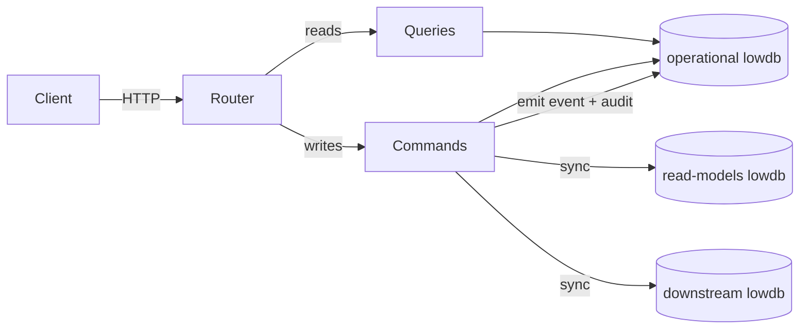

# PetHub Local — Application Guide

> A self-contained Express + lowdb application bundled in this repository under
> [apps/pethub-local](../../apps/pethub-local). It exists to give the Playwright suite
> a **deterministic, self-owned** system under test for full-stack QA practice:
> UI, REST API, accessibility, event-driven read models, and downstream replica
> reconciliation.
>
> For **how to test** this app, see the companion
> [PetHub Local — Testing Guide](testing.md).

---

## 1. Why this app exists

The portfolio targets three systems. Two are public (Swagger Petstore, Sauce
Demo) and therefore flaky and outside our control. PetHub Local is the **primary**
target because it is:

- **Deterministic** — seed data is fixed and a reset endpoint restores it on demand.
- **Self-owned** — we control the schema, the routes, and the bugs.
- **Full-stack** — one process serves an admin UI, a storefront UI, an operations
  portal, and a JSON REST API, all backed by the same data.
- **Backend-flavoured** — it deliberately models **CQRS-style read models** and
  **downstream system replicas** so tests can practice multi-database
  reconciliation, eventual-consistency polling, and SQL-style joins — the kind of
  investigation real backend QA work involves.

It is intentionally **Sauce-Demo-shaped** on the storefront so the same Playwright
patterns (page objects, fixtures, `data-test` selectors) transfer between the
public and local targets.

---

## 2. Tech stack

| Concern         | Choice                                                                                   |
| --------------- | ---------------------------------------------------------------------------------------- |
| HTTP server     | [Express 4](https://expressjs.com/)                                                      |
| Persistence     | [lowdb 7](https://github.com/typicode/lowdb) — JSON-file document store                  |
| Runtime         | Node 22 (see [.nvmrc](../../.nvmrc)), executed via `tsx`                                 |
| Rendering       | Server-side template literals (no client framework)                                      |
| Styling/scripts | Static assets under [apps/pethub-local/http/static](../../apps/pethub-local/http/static) |

There is no build step and no client bundle. Pages are HTML strings rendered on
the server; a small `theme.js`/`theme.css` pair handles the dark/light toggle.

---

## 3. Running the app

```powershell
npm run app:start          # tsx apps/pethub-local/server.ts
```

The app listens on **`http://127.0.0.1:3000`** by default (override with the
`APP_PORT` environment variable).

| Surface           | Path      | Purpose                                              |
| ----------------- | --------- | ---------------------------------------------------- |
| Admin dashboard   | `/`       | Aggregated operational + derived data + API explorer |
| Storefront        | `/shop`   | Customer-facing buy flow (Sauce-Demo-shaped)         |
| Clinic            | `/clinic` | Veterinary appointment-booking business (wizard)     |
| Operations portal | `/ops`    | QA investigation surface for cross-system drift      |
| QA Test Lab       | `/lab`    | UI automation playground (forms, widgets, menus, …)  |
| REST API          | `/api`    | JSON endpoints (see [§7](#7-rest-api))               |
| Static assets     | `/static` | Theme CSS/JS                                         |

Health check: `GET /api/health` → `{ "status": "ok", "service": "pethub-local" }`.
Reset to seed: `POST /api/admin/reset` (used by Playwright `globalSetup`).

Stop it with `Ctrl + C`, or stop the background terminal if it was launched by
Playwright's `webServer`.

---

## 4. Architecture

The codebase follows a light **CQRS / command–query** split layered over lowdb.

```
apps/pethub-local/
  server.ts              Express bootstrap: wires routers, starts listener
  commands.ts            Write side  — create/update/delete operations
  queries.ts             Read side   — all read operations
  database.ts            Operational store (lowdb) + domain logic + events
  database.seed.ts       Deterministic seed builders (pets, users, orders, ...)
  read-models.ts         CQRS read-model store (second lowdb file)
  downstream-systems.ts  Downstream replica store (third lowdb file)
  http/
    render-helpers.ts    Shared HTML head, stat cards, theme toggle
    responses.ts         JSON error helpers (e.g. respondNotFound)
    static/              theme.css, theme.js, lab.js
  admin/admin.ts         Admin dashboard rendering
  storefront/storefront.ts  Storefront sessions, cart, page rendering
  clinic/clinic.ts       PetHub Clinic business: in-memory store + booking wizard rendering
  ops/ops.ts             Ops portal rendering + incident catalogue
  platform.ts            Pure logic for the v2 platform testing surfaces
  lab/
    lab.ts               QA Test Lab UI page rendering (forms, widgets, menus, frames, …)
    http-lab.ts          Pure helpers for the httpbin-style /api/lab utilities
  routes/
    api.routes.ts        /api/*       JSON REST surface
    admin.routes.ts      /*           admin dashboard
    storefront.routes.ts /shop/*      buy flow
    clinic.routes.ts     /clinic/*    clinic booking UI
    clinic-api.routes.ts /api/clinic/* clinic JSON API
    ops.routes.ts        /ops/*       investigation portal
    qa.routes.ts         /api/*       v2 platform testing surfaces
    lab.routes.ts        /lab/*       QA Test Lab UI playground
    lab-api.routes.ts    /api/lab/*   stateless HTTP utilities
  data/
    pethub-local-db.json       operational (source of truth)
    read-models-db.json        CQRS projections
    downstream-systems-db.json downstream replicas
```

### Request flow



Every **command** does four things in `database.ts`:

1. Mutates the operational store and writes it to disk.
2. **Emits a domain event** (`pet.created`, `order.status-updated`, …) into an
   `events` collection.
3. Appends a human-readable **audit-log** row tying the change to its entity.
4. Calls `syncDerivedStores()`, which **re-projects** the operational data into
   the read-model store and the downstream store.

Queries only ever read; they never mutate.

---

## 5. The three databases (the core concept)

This is the most distinctive part of the app and the reason most backend-style
tests exist. Three independent JSON files live under
[apps/pethub-local/data](../../apps/pethub-local/data):

| Store           | File                         | Represents                                  | Shape                                     |
| --------------- | ---------------------------- | ------------------------------------------- | ----------------------------------------- |
| **Operational** | `pethub-local-db.json`       | The system of record (write model)          | Full entities + events + audit + sessions |
| **Read models** | `read-models-db.json`        | CQRS projections optimised for reads        | Slimmed, renamed projections              |
| **Downstream**  | `downstream-systems-db.json` | Replicas in other systems (billing, CRM, …) | Renamed/remapped replica records          |

The same domain fact appears in all three stores under **different names**, which
is exactly what makes reconciliation tests meaningful:

| Concept        | Operational | Read model          | Downstream replica                        |
| -------------- | ----------- | ------------------- | ----------------------------------------- |
| A pet          | `pets`      | `petCatalog`        | `inventoryReplica` (`availabilityStatus`) |
| A user         | `users`     | `userDirectory`     | `crmCustomers`                            |
| An employee    | `employees` | `employeeDirectory` | `hrEmployees`                             |
| A customer     | `customers` | `customerRegistry`  | `customerProfiles`                        |
| An order       | `orders`    | `orderLedger`       | `billingOrders` (`orderStatus`, `amount`) |
| A domain event | `events`    | `eventFeed`         | `analyticsEvents`                         |

> **Why this matters for QA:** the read model and downstream replicas are
> projected from the operational store. When a projection is incomplete or lags,
> the three stores **disagree**, and the operations portal is where that
> disagreement becomes visible. Tests reconcile them with SQL-style joins (see the
> testing guide).

---

## 6. The UI surfaces

> All primary surfaces share a **cross-app navigation switcher** rendered by
> `renderPrimaryNavLinks` in
> [apps/pethub-local/http/render-helpers.ts](../../apps/pethub-local/http/render-helpers.ts):
> Admin, Storefront, Clinic, Operations and the Test Lab each link to every other
> surface (via stable `data-test="app-nav-<id>"` hooks), so any surface is
> reachable from any other.

### 6.1 Admin dashboard (`/`)

A single dense page aggregating every backend concept the suite exercises:

- Operational tables: **Pets, Users, Customers, Employees, Orders**.
- **Audit log + relations** — each mutation row links its user, pet, and order.
- **Read models** — the projected CQRS store, rendered side-by-side.
- **Downstream systems** — the replica store (billing/analytics/CRM/HR).
- A **Swagger-style explorer** for ad hoc API calls.

It is the fastest way to eyeball all three stores at once.

### 6.2 Storefront (`/shop`)

A deliberately **Sauce-Demo-shaped** buy flow so Playwright patterns transfer:

```
/shop                 login (demo creds listed inline on the page)
/shop/inventory       product grid with server-side sort (?sort=az|za|lohi|hilo)
/shop/item/:id        product detail / deep link
/shop/cart            session cart (in-memory, NOT persisted to lowdb)
/shop/checkout        customer info form with field validation
/shop/complete        order confirmation
```

Key behaviours:

- **Auth**: cookie-based session (`storefront_session`) held in an in-memory
  `Map`. Four demo personas (see below), all with password `pethub123`.
- **Cart**: lives on the session only. The cart badge counts **lines**, the
  subtotal sums line totals.
- **Inventory filtering**: `sold` pets are filtered out of the grid by design, so
  15 of the 18 seeded pets are visible (12 available + 3 pending).
- **Checkout**: POSTing the form **creates a real order** in the operational
  store, which emits `order.created` and re-projects to the derived stores.

#### Storefront demo personas

| Username           | Password    | Notes                                         |
| ------------------ | ----------- | --------------------------------------------- |
| `standard_user`    | `pethub123` | Normal happy-path user                        |
| `problem_user`     | `pethub123` | Reserved for problem-scenario practice        |
| `performance_user` | `pethub123` | Reserved for performance-scenario practice    |
| `locked_out_user`  | `pethub123` | Login is rejected with a "locked out" message |

> The login page renders these credentials inline, so the page itself doubles as
> the credential reference. They are mirrored for tests in
> [src/helpers/test-data.ts](../../src/helpers/test-data.ts)
> (`pethubLocalUsers` / `pethubLocalPassword`). Each storefront persona maps to a
> real seeded `userId` so orders are attributed to an actual user row.

### 6.3 Operations portal (`/ops`)

A dedicated QA-investigation surface — **not** a customer experience. Hero copy is
intentionally optimistic so a tester must dig into the underlying data to confirm
reality.

```
/ops               overview — stat cards + drift summaries
/ops/queue         work queue derived from current data
/ops/comparisons   side-by-side dump of source vs read model vs downstream
/ops/incidents     catalogue of known investigation scenarios
/ops/incidents/:slug  per-incident detail (source of truth, what to check)
```

`/ops/comparisons` is the headline view: source orders, read-model projections,
and downstream replicas rendered together so mismatches are obvious.

### 6.4 QA Test Lab (`/lab`)

A self-contained **UI automation playground** (inspired by
the-internet.herokuapp.com) for practising browser-side test techniques against a
deterministic, repo-owned surface. Every interaction is wired through `data-test`
hooks in [apps/pethub-local/http/static/lab.js](../../apps/pethub-local/http/static/lab.js)
(no inline handlers); pages are rendered by
[apps/pethub-local/lab/lab.ts](../../apps/pethub-local/lab/lab.ts).

```
/lab               overview — index of every challenge
/lab/forms         all input types + client-side validation → success banner
/lab/dynamic       deferred loading spinner, add/remove elements, enable/disable
/lab/dialogs       native alert / confirm / prompt with reflected results
/lab/tables        searchable + column-sortable data table
/lab/widgets       tabs, accordion, modal, tooltip, progress bar, toast, clipboard, key press
/lab/menus         native/multiple/dependent selects, custom listbox, action, context, flyout, hamburger & split menus
/lab/frames        an iframe that updates content scoped to its own document
/lab/frames/inner  the embedded frame page
/lab/shadow-dom    an open shadow-root custom element (`<qa-shadow-card>`)
```

Each page is accessible (labels, roles, ARIA state) so it doubles as an
accessibility-testing target.

### 6.5 PetHub Clinic (`/clinic`)

A self-contained **veterinary appointment-booking business** layered on top of
the platform — a worked example of adding a whole new vertical. It keeps its own
**deterministic, in-memory store** (seeded at module load, reset on every server
start) in [apps/pethub-local/clinic/clinic.ts](../../apps/pethub-local/clinic/clinic.ts),
so it never touches the lowdb petstore schema and the existing suites stay green.

```
/clinic                       home — services, pricing, vets, stats
/clinic/book                  four-step booking wizard (service & vet → date & slot → details → review)
/clinic/confirmation/:ref     confirmation with a unique CLN-#### reference
/clinic/appointments          table of every booked appointment
```

Key behaviours:

- **Booking wizard**: a single `<form method="post" action="/clinic/book">` whose
  four fieldsets are toggled into steps by
  [clinic.js](../../apps/pethub-local/http/static/clinic.js). Without JavaScript
  all steps are visible and the form still submits (progressive enhancement).
- **Deterministic slots**: six fixed daily times (09:00–14:00); 12:00 is
  intentionally **disabled** ("Fully booked") to exercise unavailable options.
- **References**: each appointment gets a sequential `CLN-####` reference; tests
  assert on the reference they create rather than absolute counts.
- **Validation**: server- and client-side checks for service, vet, date, an
  available slot, owner, pet and a well-formed email.

---

## 7. REST API

All endpoints are under `/api` and return JSON. The surface intentionally mirrors
the public Swagger Petstore shape (form updates, `findByStatus`, `findByTags`,
image upload, user lifecycle) so client code transfers between targets.

### Pets

| Method & path                    | Purpose                                      |
| -------------------------------- | -------------------------------------------- |
| `GET /api/pets`                  | List pets (newest first)                     |
| `GET /api/pets/:id`              | Single pet                                   |
| `GET /api/pets/findByStatus`     | Filter by `?status=available\|pending\|sold` |
| `GET /api/pets/findByTags`       | Filter by `?tags=` (repeatable)              |
| `GET /api/pets/:id/relations`    | Pet with its related orders                  |
| `POST /api/pets`                 | Create pet (201)                             |
| `PUT /api/pets/:id`              | Replace pet                                  |
| `POST /api/pets/:id`             | Swagger-style form update                    |
| `POST /api/pets/:id/uploadImage` | Swagger-style image upload                   |
| `DELETE /api/pets/:id`           | Delete pet (204/404)                         |

### Users

| Method & path                      | Purpose                  |
| ---------------------------------- | ------------------------ |
| `GET /api/users`                   | List users               |
| `GET /api/users/:id`               | Single user              |
| `GET /api/users/by-username/:name` | Lookup by username       |
| `GET /api/users/:id/relations`     | User with their orders   |
| `POST /api/users`                  | Create user              |
| `POST /api/users/createWithArray`  | Bulk create (array body) |
| `POST /api/users/createWithList`   | Bulk create (list body)  |
| `GET\|POST /api/users/login`       | Create a session         |
| `GET\|POST /api/users/logout`      | Clear sessions           |

### Employees & customers (business profiles)

| Method & path            | Purpose         |
| ------------------------ | --------------- |
| `GET /api/employees`     | List employees  |
| `GET /api/employees/:id` | Single employee |
| `POST /api/employees`    | Create employee |
| `GET /api/customers`     | List customers  |
| `GET /api/customers/:id` | Single customer |
| `POST /api/customers`    | Create customer |

### Orders

| Method & path                   | Purpose               |
| ------------------------------- | --------------------- |
| `GET /api/orders`               | List orders           |
| `GET /api/orders/:id`           | Single order          |
| `GET /api/orders/:id/relations` | Order with pet + user |
| `POST /api/orders`              | Create order          |
| `PATCH /api/orders/:id/status`  | Update status         |

### Audit, events & derived stores

| Method & path                  | Purpose                                    |
| ------------------------------ | ------------------------------------------ |
| `GET /api/audit-log`           | Recent audit rows                          |
| `GET /api/audit-log/relations` | Audit rows joined to their entities        |
| `GET /api/events`              | Recent domain events                       |
| `GET /api/read-models`         | Full read-model snapshot (all projections) |
| `GET /api/downstream-systems`  | Full downstream replica snapshot           |

### Admin

| Method & path           | Purpose                                         |
| ----------------------- | ----------------------------------------------- |
| `GET /api/health`       | Liveness probe                                  |
| `POST /api/admin/reset` | Truncate + reseed all three stores (test setup) |

### Platform & QA testing surfaces (v2)

A second tier of endpoints exists purely to give QA engineers more **types** of
testing to practice against a deterministic backend. They are additive — the v1
surface above is unchanged. Implementation lives in
[apps/pethub-local/platform.ts](../../apps/pethub-local/platform.ts) and
[apps/pethub-local/routes/qa.routes.ts](../../apps/pethub-local/routes/qa.routes.ts).

| Method & path              | Testing type           | Behaviour                                                                        |
| -------------------------- | ---------------------- | -------------------------------------------------------------------------------- |
| `GET /api/version`         | Smoke / observability  | Build metadata (`name`, `version`, `apiVersions`, `node`, `startedAt`)           |
| `GET /api/ready`           | Smoke / readiness      | Readiness probe — `200` ready / `503` not ready                                  |
| `GET /api/metrics`         | Observability          | Prometheus text-format gauges/counters                                           |
| `GET /api/openapi.json`    | Contract               | Minimal OpenAPI 3.0 document describing these paths                              |
| `POST /api/auth/login`     | Auth                   | Issues a signed bearer token (`200`) or `401` on bad credentials                 |
| `GET /api/auth/me`         | Auth / RBAC            | Returns token identity; `401` without/with an invalid token                      |
| `GET /api/v2/pets`         | Pagination/filter/sort | Paginated envelope: `?page&limit&sort&order&category&status&minPrice&maxPrice&q` |
| `POST /api/v2/pets`        | Validation (negative)  | Strict validation → `201` created or `422` with field-level errors               |
| `DELETE /api/v2/pets/:id`  | RBAC                   | Requires `admin` bearer token → `204` / `401` / `403`                            |
| `POST /api/v2/orders`      | Idempotency            | Honours `Idempotency-Key`; replays the same order (`200`) instead of dup         |
| `GET /api/v2/rate-limited` | Rate limiting          | Fixed window keyed by `X-Client-Id` → `429` + `Retry-After` once exhausted       |
| `GET /api/v2/echo`         | Security (XSS)         | Reflects `?q=` both raw and HTML-escaped; sets `X-Content-Type-Options`          |
| `POST /api/jobs`           | Async                  | Enqueues a job → `202` with a `jobId`                                            |
| `GET /api/jobs/:id`        | Async / polling        | Advances `queued → running → completed` one step per poll (deterministic)        |

**Auth credentials** (fixed, separate from the storefront personas):

| Username | Password       | Role     |
| -------- | -------------- | -------- |
| `admin`  | `Admin#12345`  | `admin`  |
| `editor` | `Editor#12345` | `editor` |
| `viewer` | `Viewer#12345` | `viewer` |

> **Determinism notes:** tokens are HMAC-signed with a fixed secret; rate-limit
> buckets are keyed by a client-supplied `X-Client-Id` so each test is isolated;
> async jobs advance by **poll count** (not wall-clock) so a polling loop always
> sees the same transitions; idempotency keys are remembered for the process
> lifetime. This keeps non-2xx behaviour repeatable.

### QA Test Lab — HTTP utilities (`/api/lab`)

A set of **stateless, httpbin-style** helpers for practising raw HTTP mechanics —
request reflection, status codes, redirects, auth schemes, cookies, encoding,
caching, compression and content negotiation. They hold no domain state, so they
are completely deterministic. Implementation:
[apps/pethub-local/lab/http-lab.ts](../../apps/pethub-local/lab/http-lab.ts) (pure
helpers) and
[apps/pethub-local/routes/lab-api.routes.ts](../../apps/pethub-local/routes/lab-api.routes.ts).

| Method & path                   | Testing type        | Behaviour                                                               |
| ------------------------------- | ------------------- | ----------------------------------------------------------------------- |
| `ALL /api/lab/anything`         | Request reflection  | Echoes method, path, query, headers and parsed body                     |
| `GET /api/lab/headers`          | Request inspection  | Returns the request headers                                             |
| `GET /api/lab/ip`               | Request inspection  | Returns the caller IP                                                   |
| `GET /api/lab/user-agent`       | Request inspection  | Returns the `User-Agent`                                                |
| `GET /api/lab/uuid`             | Data generation     | A fresh random UUID per call                                            |
| `ALL /api/lab/status/:code`     | Status handling     | Responds with the requested status (clamped 100–599; `204`/`304` empty) |
| `GET /api/lab/delay/:seconds`   | Latency / timeout   | Delays the response (clamped 0–3s) then echoes `delayedSeconds`         |
| `GET /api/lab/redirect/:n`      | Redirects           | A `302` chain of `n` hops (clamped 0–10) ending at `/anything`          |
| `GET /api/lab/basic-auth/:u/:p` | Auth (Basic)        | `401` + `WWW-Authenticate` until matching `Authorization: Basic`        |
| `GET /api/lab/bearer`           | Auth (Bearer)       | `401` without a token; echoes the token when present                    |
| `GET /api/lab/cookies`          | Cookies             | Reflects the request cookies                                            |
| `GET /api/lab/cookies/set`      | Cookies             | Sets a cookie via `Set-Cookie` (`?name&value`)                          |
| `GET /api/lab/cookies/delete`   | Cookies             | Expires a cookie (`?name`)                                              |
| `GET /api/lab/base64/encode`    | Encoding            | Base64-encodes `?value`                                                 |
| `GET /api/lab/base64/decode`    | Encoding            | Base64-decodes `?value`; `400` on invalid input                         |
| `GET /api/lab/cache`            | Caching             | Returns an `ETag`; `304` when the `If-None-Match` matches               |
| `GET /api/lab/gzip`             | Compression         | Gzip-encoded JSON body (`Content-Encoding: gzip`, `gzipped:true`)       |
| `GET /api/lab/json`             | Content negotiation | A sample JSON payload                                                   |
| `GET /api/lab/xml`              | Content negotiation | The same payload as `application/xml`                                   |
| `GET /api/lab/html`             | Content negotiation | The same payload as an HTML fragment                                    |

### PetHub Clinic API (`/api/clinic`)

The JSON API behind the Clinic business, backed by the same deterministic
in-memory store as the clinic UI. Implementation:
[apps/pethub-local/clinic/clinic.ts](../../apps/pethub-local/clinic/clinic.ts) and
[apps/pethub-local/routes/clinic-api.routes.ts](../../apps/pethub-local/routes/clinic-api.routes.ts).

| Method & path                       | Testing type          | Behaviour                                                     |
| ----------------------------------- | --------------------- | ------------------------------------------------------------- |
| `GET /api/clinic/services`          | Reference data        | Services with duration and price                              |
| `GET /api/clinic/vets`              | Reference data        | Veterinarians and specialties                                 |
| `GET /api/clinic/slots`             | Reference data        | Daily time slots (one is `available:false`); echoes `?date`   |
| `POST /api/clinic/appointments`     | Validation (negative) | Books an appointment → `201` or `422` with field-level errors |
| `GET /api/clinic/appointments`      | Read                  | Every booked appointment                                      |
| `GET /api/clinic/appointments/:ref` | Read / not-found      | One appointment by reference → `200` / `404`                  |

---

## 8. Data model

Operational record types are defined in
[apps/pethub-local/database.ts](../../apps/pethub-local/database.ts). Highlights:

- **PetRecord** — `id, name, category, status('available'|'pending'|'sold'),
price, notes, tags[], photoUrls[], timestamps`.
- **UserRecord** — `id, username, firstName, lastName, email, role, password?,
phone?, userStatus?`.
- **EmployeeRecord** / **CustomerRecord** — business profiles linked to a user via
  `userId`, with segment/loyalty/department/status enums.
- **OrderRecord** — `id, petId, userId, quantity, status('placed'|'approved'|
'completed'|'cancelled'), totalAmount, timestamps`.
- **AuditRecord** — `entityType, entityId, action, details` (human readable).
- **LocalAppEvent** — `type, entityType, entityId, payload` (machine readable).
- **SessionRecord** — API login sessions.

Ids use a safe max-based `nextId` helper rather than `Date.now()`, so rapid
sequential inserts never collide.

### Seed data

[apps/pethub-local/database.seed.ts](../../apps/pethub-local/database.seed.ts)
produces fresh arrays on every reset, with **deliberately staggered timestamps**
so "newest first" sorts and audit ordering have variety:

- **18 pets** across Dogs, Cats, Birds, Fish, etc. (price ladder ~$35–$2,800).
  12 available + 3 pending + 3 sold. Sold pets are hidden from the storefront grid.
- **Users, employees, customers** with realistic roles and segments.
- **Orders** spanning `placed`, `approved`, `completed` states across different
  ages, so the ops queue and comparisons views have meaningful content.

Because seeding is deterministic, screenshots and tests produce stable output. The
screenshot tour in the [README](../../README.md) is generated by resetting first.

---

## 9. Intentional drift scenarios (the "bugs")

The operations portal ships a catalogue of investigation scenarios in
[apps/pethub-local/ops/ops.ts](../../apps/pethub-local/ops/ops.ts) (`opsCases`).
These are **on purpose** — they give cross-system reconciliation tests something
real to catch:

| Slug                   | Severity | What drifts                                                                                                                |
| ---------------------- | -------- | -------------------------------------------------------------------------------------------------------------------------- |
| `projection-lag`       | high     | A source order can move forward while a projection still shows an older status.                                            |
| `missing-analytics`    | medium   | A workflow looks successful operationally but is absent from the analytics replica.                                        |
| `order-total-mismatch` | high     | A multi-item storefront order persists only the **first** cart line's `petId`, while quantity and total sum **all** lines. |

The `order-total-mismatch` case is wired into the live checkout flow: in
[routes/storefront.routes.ts](../../apps/pethub-local/routes/storefront.routes.ts)
the `POST /shop/checkout` handler writes one order whose `petId` is
`cartItems[0].id`, but whose `quantity` and `totalAmount` aggregate every line.
So an order's pet relation can understate what was actually purchased — a classic
"the UI looked right, the data didn't" defect for tests to expose.

---

## 10. Accessibility

The app is built to pass WCAG 2.0/2.1 **A + AA** checks on its primary surfaces.
Notable deliberate choices live in the rendering helpers — for example, the
medium-severity ops pill overrides white-on-orange text with dark text because
white-on-`#d97706` only reaches 3.18:1 contrast, below the 4.5:1 AA minimum for
normal text. The accessibility suite (`@axe-core/playwright`) enforces this; see
the testing guide.

---

## 11. Operational notes

- **Single shared file:** the operational store is one JSON file. Concurrent
  writes from multiple test files can corrupt it, so the Playwright local config
  runs `workers: 1` and serialises all local specs through one Express process.
- **Reset between runs:** `POST /api/admin/reset` restores the canonical seed and
  re-projects the derived stores. Playwright's `globalSetup` calls it before the
  local suite.
- **No external dependencies:** the app needs nothing beyond `npm install`; it is
  fully offline and safe to run anywhere.

---

## See also

- [PetHub Local — Testing Guide](testing.md) — how to write and run
  tests against this app.
- [README.md](../../README.md) — portfolio overview and visual tour.
- [AGENTS.md](../../AGENTS.md) / [TEST_AUTOMATION_STANDARDS.md](../../TEST_AUTOMATION_STANDARDS.md)
  — engineering standards.
