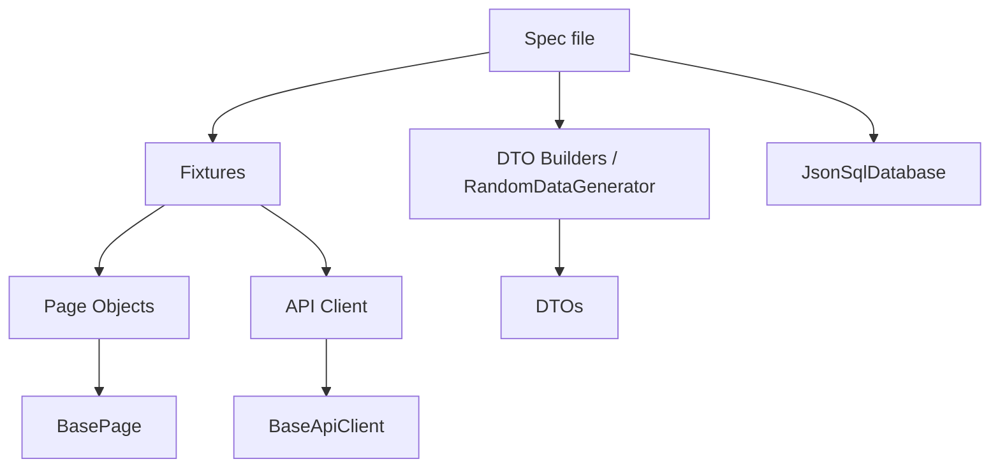

# PetHub Local - Testing Guide

> How to write and run automated tests against the **PetHub Local** app. For
> what the app _is_ and how it's built, read the
> [PetHub Local - Application Guide](app.md) first.
>
> The authoritative engineering rules live in
> [TEST_AUTOMATION_STANDARDS.md](../../TEST_AUTOMATION_STANDARDS.md) and
> [AGENTS.md](../../AGENTS.md). This guide is the practical, app-specific companion.

---

## 1. What gets tested

PetHub Local is the **primary** target in the suite because it is deterministic
and self-owned. Four flavours of test run against it, all under
[tests/dev/pethub-local](../../tests/dev/pethub-local):

| Type              | Folder  | What it covers                                                                              |
| ----------------- | ------- | ------------------------------------------------------------------------------------------- |
| **UI**            | `ui/`   | Admin, storefront buy flow, ops portal, Test Lab, Clinic, cross-app nav - across 3 browsers |
| **API**           | `api/`  | REST endpoints + cross-database reconciliation via SQL-style queries                        |
| **Accessibility** | `a11y/` | WCAG 2.0/2.1 A+AA on every primary surface                                                  |

The cross-database tests are what make this target special: they assert that the
operational store, the CQRS read models, and the downstream replicas **agree** -
and catch the deliberate drift scenarios when they don't.

### Platform testing surfaces (v2)

[pethub-local-platform.api.spec.ts](../../tests/dev/pethub-local/api/pethub-local-platform.api.spec.ts)
exercises a dedicated tier of endpoints (see the
[app guide §7](app.md#7-rest-api)) so the suite demonstrates more
**types** of API testing against a deterministic backend:

| Testing type                     | What the spec asserts                                             |
| -------------------------------- | ----------------------------------------------------------------- |
| Observability / smoke            | `/version`, `/ready`, `/metrics` (Prometheus), `/openapi.json`    |
| Authentication & RBAC            | bearer token issue/verify, `401`/`403`, role-gated delete         |
| Input validation (negative)      | `422` with field-level error codes, enum + boundary checks        |
| Pagination / filtering / sorting | envelope metadata, no page overlap, sort + filter + search        |
| Idempotency                      | repeated `Idempotency-Key` replays one order                      |
| Rate limiting                    | `429` + `Retry-After` after the window, per-client isolation      |
| Security (XSS)                   | reflected input is HTML-escaped; `X-Content-Type-Options` header  |
| Asynchronous jobs                | `queued → running → completed` poll progression; `404` unknown id |

### QA Test Lab surfaces

The **QA Test Lab** adds two more practice surfaces (see the
[app guide §6.4](app.md#64-qa-test-lab-lab) and
[§7 `/api/lab`](app.md#qa-test-lab--http-utilities-apilab)):

- [pethub-local-lab.api.spec.ts](../../tests/dev/pethub-local/api/pethub-local-lab.api.spec.ts)
  exercises the stateless httpbin-style HTTP utilities at `/api/lab`.
- [lab-ui.spec.ts](../../tests/dev/pethub-local/ui/lab-ui.spec.ts) and
  [lab.a11y.spec.ts](../../tests/dev/pethub-local/a11y/lab.a11y.spec.ts) cover the
  `/lab` UI playground across browsers and against the a11y baseline.

| Testing type              | What the spec asserts                                                                                                            |
| ------------------------- | -------------------------------------------------------------------------------------------------------------------------------- |
| Request reflection        | `/anything` echoes method, body, query and headers; `/uuid` uniqueness                                                           |
| Status-code handling      | `/status/:code` returns 2xx-5xx on demand (incl. `418`)                                                                          |
| Latency / timeouts        | `/delay/:seconds` waits before responding                                                                                        |
| Redirects                 | `/redirect/:n` chains `302`s (assert `Location` with `maxRedirects:0`)                                                           |
| Auth schemes              | Basic (`401` → success) and Bearer token echo                                                                                    |
| Cookies                   | reflect, `Set-Cookie`, delete                                                                                                    |
| Encoding                  | base64 encode/decode (+ `400` on invalid)                                                                                        |
| Caching                   | `ETag` then `304` on `If-None-Match`                                                                                             |
| Compression               | gzip-encoded JSON body                                                                                                           |
| Content negotiation       | JSON / XML / HTML variants of one payload                                                                                        |
| Forms & client validation | every input type; success banner only when valid                                                                                 |
| Dynamic content           | deferred loading spinner, add/remove elements, enable/disable                                                                    |
| JavaScript dialogs        | `alert` / `confirm` / `prompt` via `page.on('dialog')`                                                                           |
| Tables                    | search filtering + column sorting                                                                                                |
| Interactive widgets       | tabs, accordion, modal, tooltip, progress bar, toast, clipboard, keys                                                            |
| Menus & dropdowns         | native/multiple/dependent selects, custom listbox, action, context, flyout, hamburger & split menus                              |
| Popups & layers           | anchored popover, auto-dismissing notification stack, cookie banner, slide-in drawer, stacked modals, reorderable z-index layers |
| Frames                    | interacting with content inside an iframe (`frameLocator`)                                                                       |
| Shadow DOM                | piercing an open shadow root                                                                                                     |

### PetHub Clinic business

The **PetHub Clinic** vertical (see the
[app guide §6.5](app.md#65-pethub-clinic-clinic) and
[§7 `/api/clinic`](app.md#pethub-clinic-api-apiclinic)) is covered end-to-end:

- [clinic.api.spec.ts](../../tests/dev/pethub-local/api/clinic.api.spec.ts) -
  reference data, the booking happy path with read-back, `422` validation and
  `404` not-found paths via [LocalClinicApiClient](../../src/helpers/api-clients/pethub-local-clinic.client.ts).
- [clinic-ui.spec.ts](../../tests/dev/pethub-local/ui/clinic-ui.spec.ts) -
  the four-step booking wizard happy path, per-step validation, inline email
  validation on the details step, the review summary, back navigation and the
  appointment surfacing on the appointments page.
- [clinic.a11y.spec.ts](../../tests/dev/pethub-local/a11y/clinic.a11y.spec.ts)
  - the a11y baseline on the home, booking, appointments and confirmation pages.

### Cross-app navigation

[cross-navigation.spec.ts](../../tests/dev/pethub-local/ui/cross-navigation.spec.ts)
asserts the shared app switcher makes every primary surface (Admin, Storefront,
Clinic, Operations, Test Lab) mutually reachable and never links to itself.

---

## 2. Prerequisites

- **Node 22** (see [.nvmrc](../../.nvmrc)). Check with `node --version`.
- Dependencies installed: `npm ci` (or `npm install`).
- Playwright browser binaries installed: `npx playwright install`.
- A quick environment sanity check: `npm run doctor`
  (prints versions and runs `tsc --noEmit`).

> You do **not** need to start the app manually. The local Playwright config owns
> a `webServer` block that launches `npm run app:start` and reuses an
> already-running instance when one is found.

---

## 3. Running the tests

```powershell
npm run test:local             # full PetHub Local suite (serial)
npm run test:pethub-local      # alias of the above
npm run test:pethub-local:ui   # UI specs only (chromium + firefox + webkit)
npm run test:pethub-local:api  # API + cross-database specs only
npm run test:a11y              # accessibility project only
```

Tiered subsets (these span all three targets, local included):

```powershell
npm run test:smoke             # minimum "is it alive" signal
npm run test:critical          # business-critical happy paths
```

Reports:

```powershell
npm run report:local           # opens the PetHub Local HTML report
```

> `npm test` runs the **external** suite first (Swagger Petstore + Sauce Demo,
> fully parallel) and then the **local** suite (serial). The two use separate
> configs and write separate HTML reports so they never clobber each other.

---

## 4. Why the local suite is serial

The operational store is a **single shared JSON file** (lowdb). Two test files
writing concurrently can corrupt it. So
[playwright.local.config.ts](../../playwright.local.config.ts) sets:

- `workers: 1` and `fullyParallel: false` - one Express process, one DB file.
- `webServer` - auto-starts/reuses the app on `127.0.0.1:3000`.
- `globalSetup` - resets the database to seed **before** the suite runs.
- `testIdAttribute: 'data-test'` - so `getByTestId(...)` targets app-owned ids.

API spec files additionally pin `test.describe.configure({ mode: 'serial' })` so
their cases run in a defined order against the shared state.

### Reset / deterministic state

`globalSetup` ([src/core/global-setup.ts](../../src/core/global-setup.ts)) calls
`POST /api/admin/reset`, which truncates and reseeds all three stores and
re-projects the derived ones. That is what makes every run start from the same
canonical seed data described in the app guide.

---

## 5. The layered architecture

Tests never touch raw selectors or raw HTTP. Everything flows through typed
layers so specs read like intent, not plumbing.



| Layer               | Location                                                                                                                                      | Responsibility                                                                            |
| ------------------- | --------------------------------------------------------------------------------------------------------------------------------------------- | ----------------------------------------------------------------------------------------- |
| **Fixtures**        | [src/fixtures/pethub-local/index.ts](../../src/fixtures/pethub-local/index.ts)                                                                | `test.extend` that injects every page object + the API client                             |
| **Page objects**    | [src/pages/pethub-local](../../src/pages/pethub-local)                                                                                        | One class per real screen; `readonly` locators                                            |
| **Base page**       | [src/core/ui/base.page.ts](../../src/core/ui/base.page.ts)                                                                                    | Shared `visit`/`expectVisible`/`click` helpers                                            |
| **API client**      | [src/helpers/api-clients/pethub-local-api.client.ts](../../src/helpers/api-clients/pethub-local-api.client.ts)                                | Typed wrapper over `/api`                                                                 |
| **Platform client** | [src/helpers/api-clients/pethub-local-platform.client.ts](../../src/helpers/api-clients/pethub-local-platform.client.ts)                      | Typed wrapper over the v2 platform surfaces (returns raw responses for status assertions) |
| **Base client**     | [src/core/api/base-api.client.ts](../../src/core/api/base-api.client.ts)                                                                      | `get/post/put/patch/delete` with auto `expectOk`                                          |
| **DTOs**            | [src/models/api/local.dto.ts](../../src/models/api/local.dto.ts)                                                                              | Typed transport contracts                                                                 |
| **Builders**        | [src/builders](../../src/builders) — `objects/`, `requests/`, `expected/` + [RandomDataGenerator](../../src/helpers/random-data-generator.ts) | Fluent / factory test data                                                                |
| **SQL helper**      | [src/helpers/sql/json-sql-database.ts](../../src/helpers/sql/json-sql-database.ts)                                                            | Runs SELECT/JOIN/COUNT against the JSON files directly                                    |

Path aliases (`@pethub-local-fixtures`, `@pages/*`, `@helpers/*`, `@models/*`,
`@config`, ...) are defined in [tsconfig.json](../../tsconfig.json).

---

## 6. Writing a UI test

Pull the page objects you need from the fixtures - they arrive constructed and
ready. Drive them through intention-revealing methods; never reach for raw
selectors in the spec.

```typescript
import { test, expect } from '@pethub-local-fixtures';
import { pethubLocalPassword, pethubLocalUsers } from '@helpers/test-data';

test('logs in and lists inventory', { tag: '@smoke' }, async ({ storefrontLoginPage, storefrontInventoryPage }) => {
  await storefrontLoginPage.goto();
  await storefrontLoginPage.login(pethubLocalUsers.standard, pethubLocalPassword);

  await storefrontInventoryPage.assertLoaded();
  expect(await storefrontInventoryPage.getItemCount()).toBeGreaterThan(0);
});
```

### Page-object conventions (enforced by the standards)

A page object extends `BasePage`, declares `readonly` locators set in the
constructor, and exposes `goto()` / `assertLoaded()` plus action methods:

```typescript
export class StorefrontLoginPage extends BasePage {
  readonly usernameInput: Locator;
  readonly passwordInput: Locator;
  readonly loginButton: Locator;

  constructor(page: Page) {
    super(page);
    this.usernameInput = page.getByTestId('username');
    this.passwordInput = page.getByTestId('password');
    this.loginButton = page.getByTestId('login-button');
  }

  async goto(): Promise<void> {
    await this.visit('/shop');
  }

  async login(username: string, password: string): Promise<void> {
    await this.usernameInput.fill(username);
    await this.passwordInput.fill(password);
    await this.loginButton.click();
    // wait for either success navigation OR the error banner - never a fixed sleep
    await Promise.race([
      this.page.waitForURL(/\/shop\/inventory(?:\?.*)?$/),
      this.errorBanner.waitFor({ state: 'visible' }),
    ]);
  }
}
```

### Locator priority

1. App-owned test ids - `getByTestId('login-button')` (`data-test` attribute).
2. Roles + accessible names - `getByRole('heading', { name: 'Incident not found' })`.
3. Labels / placeholders.
4. Scoped text - only as a last resort.

Avoid brittle text-only selectors, long CSS chains, and XPath for ordinary UI.

---

## 7. Writing an API test

The fixtures also provide `localApiClient`, a typed client whose base path is
`/api`. Build payloads with `RandomDataGenerator`, follow **Arrange-Act-Assert**,
and assert business outcomes.

```typescript
import { test, expect } from '@pethub-local-fixtures';
import { RandomDataGenerator } from '@helpers/random-data-generator';

test('creates and updates a pet', { tag: ['@smoke', '@critical'] }, async ({ localApiClient }) => {
  const pet = RandomDataGenerator.createLocalPet({ category: 'Dogs', status: 'pending' });

  const created = await localApiClient.createPet(pet);
  expect(created.id).toBe(pet.id);

  const updated = await localApiClient.updatePet(pet.id, {
    name: `${pet.name} Updated`,
    category: pet.category,
    status: 'available',
    price: pet.price + 100,
    notes: RandomDataGenerator.randomPetNote(),
  });

  expect(updated.name).toBe(`${pet.name} Updated`);
  expect(updated.status).toBe('available');
});
```

`BaseApiClient` automatically asserts a 2xx (`expectOk`) before returning the
parsed JSON, so the happy path stays terse. For negative cases, drop down to the
raw `request` fixture and assert the status yourself.

---

## 8. Cross-database reconciliation (the signature pattern)

This is the most valuable test type against PetHub Local. A mutation through the
API must ripple from the operational store into the read models and downstream
replicas. Because that projection is asynchronous, **poll** for eventual
consistency instead of asserting immediately, and use the SQL helper to express
relationships as joins.

```typescript
import { test, expect } from '@pethub-local-fixtures';
import { RandomDataGenerator } from '@helpers/random-data-generator';
import { JsonSqlDatabase } from '@helpers/sql/json-sql-database';

const operationalDb = new JsonSqlDatabase('apps/pethub-local/data/pethub-local-db.json');

test('persists a created pet in the operational store', async ({ localApiClient }) => {
  const pet = RandomDataGenerator.createLocalPet({ category: 'Dogs', status: 'pending' });
  await localApiClient.createPet(pet);

  // eventual consistency: poll until the projection/write settles
  await expect
    .poll(async () => {
      const [row] = await operationalDb.query<{ total: number }>('SELECT COUNT(*) AS total FROM pets WHERE id = ?', [
        pet.id,
      ]);
      return row.total;
    })
    .toBe(1);
});
```

`JsonSqlDatabase` ([source](../../src/helpers/sql/json-sql-database.ts)) reads a JSON
store file and supports `SELECT`, `INNER JOIN`, `COUNT(*)`, `WHERE`, and `?`
parameter binding. Point one instance at each store to compare them:

```typescript
const operationalDb = new JsonSqlDatabase('apps/pethub-local/data/pethub-local-db.json');
const readModelsDb = new JsonSqlDatabase('apps/pethub-local/data/read-models-db.json');
// ...and downstream-systems-db.json for the replica view
```

Remember the field renames between stores (full table in the app guide): an order
is `orders` operationally, `orderLedger` in the read model, and `billingOrders`
(`amount`, `orderStatus`) downstream. Reconciliation tests assert the same fact
lines up across all three names.

### Catching the deliberate drift

The app ships intentional inconsistencies (see _Intentional drift scenarios_ in
the app guide). For example, the `order-total-mismatch` case: a multi-item
storefront checkout persists only the **first** cart line's `petId` while the
total sums every line. A reconciliation test can drive a two-item checkout, then
assert the order's pet relation does **not** fully describe the cart - exposing
the defect through data rather than the UI.

---

## 9. Writing an accessibility test

Use the shared helper, which runs `@axe-core/playwright` with the WCAG
2.0/2.1 A+AA tag sets and **fails only on `critical` or `serious`** violations
(lower-impact issues are surfaced but not enforced, to avoid noisy runs).

```typescript
import { test } from '@pethub-local-fixtures';
import { assertNoSeriousA11yViolations } from '@helpers/a11y';
import { pethubLocalPassword, pethubLocalUsers } from '@helpers/test-data';

test.describe('storefront a11y', { tag: '@a11y' }, () => {
  test('inventory page meets the a11y baseline', async ({ storefrontLoginPage, storefrontInventoryPage, page }) => {
    await storefrontLoginPage.goto();
    await storefrontLoginPage.login(pethubLocalUsers.standard, pethubLocalPassword);
    await storefrontInventoryPage.assertLoaded();

    await assertNoSeriousA11yViolations(page);
  });
});
```

The a11y suite covers the admin dashboard, the storefront screens (login,
inventory, item detail, cart, checkout), and the ops portal views. It runs as its
own `pethub-local-a11y` project so it can be invoked alone via `npm run test:a11y`
or excluded elsewhere with `--grep-invert @a11y`.

---

## 10. Test data

Two complementary approaches:

- **`RandomDataGenerator`** ([source](../../src/helpers/random-data-generator.ts)) -
  factory methods like `createLocalPet`, `createLocalUser`, `createLocalOrder`,
  `createLocalEmployee`, `createLocalCustomer`. Use these for API/data tests.
- **Fluent builders** ([src/builders](../../src/builders)) - object builders
  (`PetBuilder`, `OrderBuilder`, `UserBuilder`) under `objects/`, request-body
  builders (`ClinicAppointmentRequestBuilder`, `LocalPetRequestBuilder`) under
  `requests/`, and expected-result builders (`ValidationErrorExpectationBuilder`)
  under `expected/`, all using `withX(...).build()` for readable, explicit
  construction when a test needs specific field values.

For unique ids in data tests, prefer the helpers' id strategy (and the
`nextUniqueId()` pattern used in the database specs) over `Date.now()` alone, to
avoid millisecond collisions on rapid sequential inserts.

The seeded storefront credentials live in
[src/helpers/test-data.ts](../../src/helpers/test-data.ts) as `pethubLocalUsers`
(`standard`, `problem`, `performance`, `lockedOut`) and `pethubLocalPassword`,
mirroring what the app renders on its login page.

---

## 11. Test tiers & tags

Tests are tagged inline with Playwright's `tag` annotation so subsets run for
tiered CI feedback:

| Tag         | When it runs          | Scope                                             |
| ----------- | --------------------- | ------------------------------------------------- |
| `@smoke`    | Every PR / commit     | Minimum "is each surface alive" signal            |
| `@critical` | Before deploy / merge | Business-critical happy paths (a subset of smoke) |
| `@a11y`     | Accessibility project | WCAG checks (own project; greppable in/out)       |

```typescript
test('returns service health', { tag: ['@smoke', '@critical'] }, async ({ localApiClient }) => {
  const health = await localApiClient.getHealth();
  expect(health.status).toBe('ok');
});
```

To extend the smoke tier, add `{ tag: '@smoke' }` to a test - no config change is
needed.

---

## 12. Async hygiene

The shared store is projected asynchronously, so timing discipline matters:

- Use `page.waitForURL(...)` after navigations, not fixed waits.
- Use `Promise.all([...])` / `Promise.race([...])` to coordinate a click with the
  resulting navigation or error state.
- Use `expect.poll(...)` for eventual consistency across the three databases.
- **Never** use arbitrary `waitForTimeout` / sleeps to "stabilise" a test.

---

## 13. Adding a new test - checklist

1. **Pick the right folder**: `ui/`, `api/`, or `a11y/` under
   [tests/dev/pethub-local](../../tests/dev/pethub-local).
2. **Reuse fixtures**: import `{ test, expect } from '@pethub-local-fixtures'` and
   pull the page objects / `localApiClient` you need.
3. **No raw selectors in specs**: if a screen lacks a page object or a needed
   locator/action, extend the page object (don't inline selectors).
4. **Type your data**: use `RandomDataGenerator` or a builder; assert against DTOs.
5. **Follow AAA** and assert business outcomes, not implementation details.
6. **Poll for cross-store assertions**; compare with `JsonSqlDatabase`.
7. **Tag** it if it belongs to a tier (`@smoke` / `@critical` / `@a11y`).
8. **Run the focused suite** and the gates before calling it done (next section).

---

## 14. Validation before "done"

From [AGENTS.md](../../AGENTS.md):

```powershell
npm run lint                   # ESLint (TS + Playwright rules)
npm run format:check           # Prettier
npx tsc --noEmit               # type check (also via npm run doctor)
npm run test:local             # run the affected local suite
```

Then update [PROGRESS.md](../../PROGRESS.md) if status, backlog, or tech-debt
changed.

---

## 15. Troubleshooting

| Symptom                                     | Likely cause / fix                                                                  |
| ------------------------------------------- | ----------------------------------------------------------------------------------- |
| Local tests interfere with each other       | Something is running them in parallel - the local config must stay `workers: 1`.    |
| Stale data across runs                      | `globalSetup` reset didn't run; trigger `POST /api/admin/reset` or rerun the suite. |
| `findByStatus`/`findByTags` returns nothing | Status/tag mismatch - check the seed data in the app guide.                         |
| Cross-store assertion flakes                | Replace a direct assertion with `expect.poll(...)`; projection is async.            |
| `npx playwright install` fails to download  | Pinned browsers rotated out of CDN - bump `@playwright/test`, reinstall.            |
| Storefront login unexpectedly fails         | Using `locked_out_user` (intentionally rejected) or wrong password (`pethub123`).   |

---

## See also

- [PetHub Local - Application Guide](app.md) - the app's design,
  data model, three-store CQRS concept, and intentional bugs.
- [TEST_AUTOMATION_STANDARDS.md](../../TEST_AUTOMATION_STANDARDS.md) - authoritative
  engineering rules.
- [README.md](../../README.md) - portfolio overview, visual tour, and full command list.
